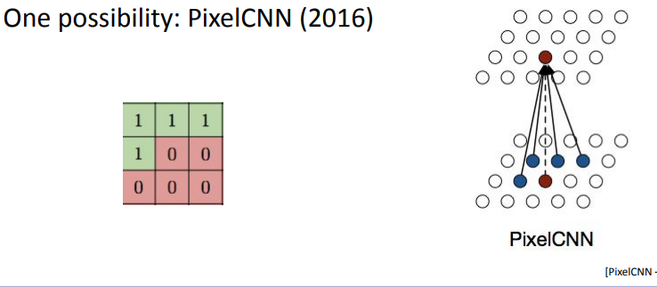
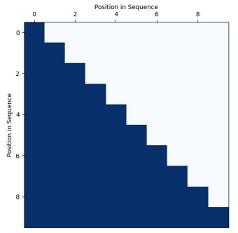

# 1. Autoregressive Models

Given a dataset $$x^{(1)},...,x^{(n)} \sim p_{\text{data}}(x)$$, we would like to learn a distribution $$p_\theta(x)$$ such that sampling from this distribution is like sampling from $$p_{\text{data}}(x)$$.

## 1.1 Naive Frequentist Approach

Suppose the support of our dataset $$p_\text{data}(x)$$ is $$\mathcal{X} = \{1,...,k\}$$.

To train this model, we count how frequently $$i \in \mathcal{X}$$ appears in the dataset and normalize it:

$$
\begin{equation}
p_\theta(x = i) = \frac{1}{\mid \mathcal{D} \mid}\sum_{d = 1}^{\mid \mathcal{D} \mid} \mathbb{I}(x^{(d)} = i)
\end{equation}
$$

where $$\mathcal{D}$$ is the dataset and $$\mathbb{I}$$ is the indicator function.

<b> Inference </b> simply a lookup of $$p_\theta$$. 

<b> Sampling </b> we can use inverse cumulative distributions to sample any distribution from a standard uniform distribution $$U(0,1)$$.
1. Get the inverse CDF of $$p_\theta$$, which is a piecewise function.
2. Sample $$u \sim U(0,1)$$.
3. Find the smallest $$i$$ such that $$p_\theta(x \leq i) \geq u$$.

<b> Limitation </b> The biggest issue with this approach is that it generalizes poorly.  

<b> Maximum Likelihood Estimation (MLE) </b> What we just did was MLE for a very simple model. MLE is formulated by taking a dataset $$x^{(1)},...,x^{(n)}$$ and finding the parameters $$\theta$$ that maximize the likelihood of the data given the model:

$$
\begin{align}
\theta^* &= \arg \min_\theta \mathcal{L}(x^{(1)},...,x^{(n)}; \theta) \\
&= \arg \min_\theta \sum_{d=1}^{\mid \mathcal{D} \mid} -\log p_\theta(x^{(d)})
\end{align}
$$

This is the generalized Negative Log-Likelihod (NLL) loss function. For our discrete distribution, the analytical solution to this problem is:

$$
\begin{equation}
\hat p_\text{data}(x) = \frac{1}{\mid \mathcal{D} \mid}\sum_{d=1}^{\mid \mathcal{D} \mid} \mathbb{I}(x^{(d)} = x)
\end{equation}
$$

<b> Stochastic Gradient Descent (SGD) </b> We already know about SGD, but its effects on the loss function can be viewed as taking the expected value of the loss:

$$
\begin{equation}
\arg \min_\theta \mathbb{E}_{x \sim p_\text{data}(x)} \left[ -\log p_\theta(x) \right]
\end{equation}
$$

Of course, SGD is used because it allows us to train our models for large datasets.

<b> Extension </b> We can also extend our model to more complex distributions like Mixture of Gaussians (MoG) or Mixture of Logistics (MoL). The idea is to use a mixture of distributions to model the data. For example, we can use a mixture of Logistics to model the data as:

$$
\begin{equation}
v \sim \sum_{i=1}^K \pi_i \text{logistic}(\mu_i, s_i) \\
p(x \mid \pi, \mu, s) = \sum_{i=1}^K \pi_i \left[\sigma(\frac{x+0.5 - \mu_i}{s_i}) - \sigma( \frac{x - 0.5 - \mu_i}{s_i} ) \right]
\end{equation}
$$

People have used these as output heads for neural networks (instead of just frequentist appraoch) and learn the parameters such that we can sample from the mixture of distributions.

With just the naive frequentist approach, there are just way too many parameters to learn and it requires way too much data to learn. We wish to tackle the high-dimensional data challenge 

## 1.2 Autoregressive Models

<b> Chain Rule </b> Any multi-variable distribution can be written as a product of conditional distributions (think Bayesian Networks). One such example is when the current variable is conditioned on all the previous variables:

$$
\begin{equation*}
p_\theta(x) = \prod_{i=1}^d p_\theta (x_i \mid x_{1:i-1})
\end{equation*}
$$

this is called an <b> autoregressive model </b>.

### 1.2.1 Bayes Net

Instead of conditioning on all the previous variables, we can figure out which variables to condition on through the Bayesian Network structure.
+ Gives great inductive bias for the underyling structure
- Sparsification introduces strong asumptions (limits expressivity)
- Limited parameter sharing

### 1.2.2 Masked Autoencoder for Distribution Estimation (MADE)

For MADE, we parametrize conditionals with neural network (learning the bayes net structure). The simplest way to think about this is as follows. Let us consider a 3-layer MLP to generate a distribution:

$$
\begin{equation}
p_\theta(x) = \mathbf{V}\sigma(\mathbf{W}_2\sigma(\mathbf{W}_1\mathbf{x}))
\end{equation}
$$

where $$\mathbf{W}_1$$ is the first layer, $$\mathbf{W}_2$$ is the second layer, and $$\mathbf{V}$$ is the output layer. Instead, we actually add masks to filter which neuron in the network affects the output of the next layer:

$$
\begin{equation}
p_\theta(x) = (\mathbf{V} \odot \mathbf{M}_3) \sigma((\mathbf{W}_2 \odot \mathbf{M}_2)\sigma((\mathbf{W}_1 \odot \mathbf{M}_1)\mathbf{x}))
\end{equation}
$$

where $$\odot$$ is the element-wise product and $$\mathbf{M}_i$$ is the mask for layer $$i$$. The masks are 0 or 1.

While this approach is expressive, it is not very efficient. It needs more parameter sharing in order to be efficient.

### 1.2.3 Causal Masked Neural Models 

This is like MADE but enables parameter sharing and adds coordinate coding to individualize conditionals.

Coordinate coding is appending the index of the variable to its features. The parameter sharing comes from one timestep to another.

An example of this is WaveNet which uses Masked Temporal 1D Convolution.

Pros:
- parameter sharing across conditionals
- add coordinate coding to individualize conditionals
Cons:
- finite context window

Casual masked neural models seem promising.

### 1.2.4 RNN

In this autoregressive context, RNNs do parameter sharing + "infinite-loop-back"

$$
\begin{equation}
\log p(\mathbf{x}) = \sum_{i=1}^d \log p_\theta(x_i \mid x_{1:i-1})
\end{equation}
$$

which the RNN parses through. This is done serially. 

Pros:
- Expressive
Cons:
- not as amenable to parallelization
- backprop has vanishing/exploding gradient issues.
- hard to have signal propagate from long history.
- expressive but not expressive enough? compared to next models.

RNN can actually be seen as a very deep special, highly restrictive causal masked model. 

## 1.3 More about Casual Masked Neural Models

### 1.3.1 Convolutional

So we would like to take the lessons we learned from MADE and apply them to convolutional networks. The idea is to use a convolutional network with a causal mask.

just like in the MADE example, we mask the convolutional kernel in an autoregressive fashion (where the kernel is ordered row-major).

Then we can autoregressively sample the pixels in the image going from left to right and top to bottom.

Doing the PixelCNN-style masking has one issue where it has a blind spot in the receptive field (doesn't see pixels to right or below). 

In terms of parameter sharing, convolutional layers are already shared when computing across an image.

### 1.3.2 Attention 

<b> Scaled Dot Product Attention </b>:

$$
\begin{align}
A(q,K,V) = \sum_i \frac{\exp \{ s(q,k_i) \}}{ \sum_j \exp \{ s(q,k_j) \} } v_i \\
s(q,k) = \frac{q \cdot k}{\sqrt{d}} \\
A(Q,K,V) = \text{softmax}(QK^T)V \\
Q = YW^Q_i \\
K = XW^K_i \\
V = XW^V_i
\end{align}
$$

for self-attention, $$X = Y$$ and they are inputs into the attention layer. For cross-attention, $X$$ is output of last encoder block and Y is output of previous decoder block.

Now we can interpret attention as learning a weighted average of the values of $$V$$. The weights are given by the inner product similarity between the query $$q$$ and the keys $$k_i$$. The weights are normalized by the softmax function.

<b> Masked Attention </b> we can now apply the autoregressive masking as inspired by MADE and PixelCNN. 

$$
\begin{align}
A(q,K,V) = \sum_i \frac{\exp \{ s(q,k_i) \}}{ \sum_{j < i} \exp \{ s(q,k_j) \} } v_i \\
s(q,k) = \frac{q \cdot k}{\sqrt{d}} - (1 - M(q,k)) * 10^{10} \\
A(Q,K,V) = \text{softmax}(QK^T - (1 - M)* 10^{10}) V
\end{align}
$$

As we can see, the masked attention is weird. We don't have to stick with this autoregressive order, but it is the most popular to do it row-major.

### 1.3.3 Tokenization

When you think of tokens, think of discrete items. Tokenization is the process of converting a complex modality into discrete data. For example, in NLP, we can convert a sentence into a sequence of tokens. 

We can tokenize using a variety of methods. The most common ones are:
- Byte-Pair Encoding (BPE) for words.
- (0-255) tokens per pixel for images.
- discrete autoencoder where bottleneck embedding is the token.

### 1.3.4 Caching

This relates mostly to transformers. You cache the $$K$$ and $$V$$ matrices for the attention layer.