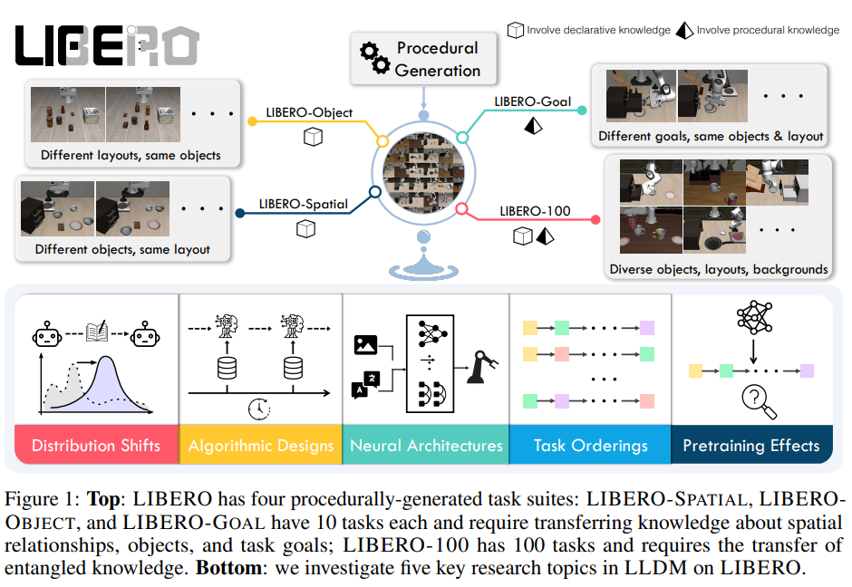

# Libero (paper)

Paper [link](https://arxiv.org/pdf/2306.03310).

This paper concerns itself with LLDM (Life-long Learning in Decision-Making), and is a benchmark with 4 task suites (130 total tasks) with high-quality human-teleoperated demonstration data.

LIBERO stands for (<b>LI</b>felong learning <b>BE</b>nchmark on <b>RO</b>bot manipulation tasks)

## Lifelong learning

Life-long learning is a paradigm where a model learns from a stream of tasks, and is able to transfer knowledge from previously learned tasks to new tasks. This is important for robotics, as robots often need to learn new skills in dynamic environments. These new skills are learned along the agent's lifetime hence the name "life-long learning". This was submitted in 2023 and at that time, it is understudied how agents transfer learn from one task to another. 

One interesting scenario listed in the paper is where an agent initially learned to retrieve a juice from the fridge is trying to learn new tasks. After learning the new tasks, it could fail to do its original task due to forgetting the details of the original task like what the juice looked like or where the fridge is (declarative knowledge) or how to grab the juice (procedural knowledge).

## Observations with LIBERO

> These are observations that LIBERO has made (Don't fully trust):
> 1. Policy architecture design is as crucial as lifelong learning algorithms. The transformer
architecture is better at abstracting temporal information than a recurrent neural network.
Vision transformers work well on tasks with rich visual information (e.g., a variety of
objects). Convolution networks work well when tasks primarily need procedural knowledge.
> 2. While the lifelong learning algorithms we evaluated are effective at preventing forgetting,
they generally perform worse than sequential finetuning in terms of forward transfer.
> 3. Our experiment shows that using pretrained language embeddings of semantically-rich task
descriptions yields performance no better than using those of the task IDs.
> 4. Basic supervised pretraining on a large-scale offline dataset can have a negative impact on
the learner’s downstream performance in LLDM.

## Background

Formulate Markov Decision Process (MDP) $$\mathcal{M} = (\mathcal{S}, \mathcal{A}, \mathcal{T}, H, \mu_0, R)$$. 
- $$\mathcal{S}$$ state space.
- $$\mathcal{A}$$ action space. 
- $$\mu_0$$ initial state distribution. 
- $$R: \mathcal{S} \times \mathcal{A} \to \mathbb{R}$$ reward function.
-  $$\mathcal{T}: \mathcal{S} \times \mathcal{A} \to \mathcal{S}$$ transition function. 
- $$H$$ horizon
- In the sparse-reward setting, $$R$$ is $$g: \mathcal{S} \to \{0,1\}$$ and is the goal predicate 

 Agent objective is to learn a policy $$\pi$$ that maximizes the expected return 
 
 $$
 \begin{equation}
 \max_{\pi} J(\pi) = \mathbb{E}_{s_t,a_t \sim \pi, \mu_0}[\sum_{t=1}^H g(s_t)]
 \end{equation}
 $$

For life-long learning, we can think of learning of $$K$$ tasks $$\{T^1, ..., T^K \}$$ sequentially (learn 1 task, then the next, and so on).

Up to the k-th task, the learning problem is formulated as follows:

$$
\begin{equation}
\underset{\pi}{\max} J_{LRL}(\pi) = \frac{1}{k} \sum_{p=1}^k [\underset{s_t^p, a_t^p \sim \pi(\cdot ; T^p, \mu_0^p)}{\mathbb{E}}[\sum_{t=1}^L g^p(s_t^p)] ]
\end{equation}
$$

Note that this problem wants to do the best over all of these tasks on average. Note that the neural network is conditioned on $$T^p$$ only and not any previous task. This means we do not have access to the previous task dataset only the weights of the current policy. 

This is for policy learning in general! If we just want to formulate the BC problem, here it is:

$$
\begin{equation}
\underset{\pi}{\max} J_{BC}(\pi) = \frac{1}{k} \sum_{p=1}^k \underset{o_t,a_t \sim D^p}{\mathbb{E}}[\sum_{t=0}^{\ell^p} 
\mathcal{L}(\pi(o_{\leq t}; T^p), a^p_t ) ]
\end{equation}
$$

In other words, we sample out of the dataset and define a loss function to match the actions of the expert policy.

In LIBERO, $$\pi$$ is a Gaussian Mixture Model (GMM) and thus also $$\mathcal{L}$$ is the negative-log-likelihood (NLL) loss.

<b>REMARK: </b> Something that I'm starting to learn based from reading this paper is that policy learning (even supervised) is generally not that well explored. There isn't a wealth of processed content on it. Instead, I have to read more supervised policy learning papers to understand how to make this work.

## Benchmark Details 

These are the 4 suites:
- libero-spatial
- libero-object
- libero-goal
- libero-100

It doesn't seem that this codebase uses depth data for its experiments. It only uses RGB and language data.

Pros:
- lots of tasks
- LIBERO-OBJECT is a good benchmark (can try and vary objects in the scene).
Cons:
- no depth data used in experiments.
- doesn't look that good.