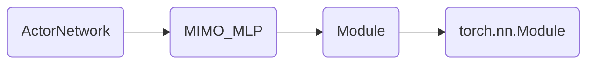
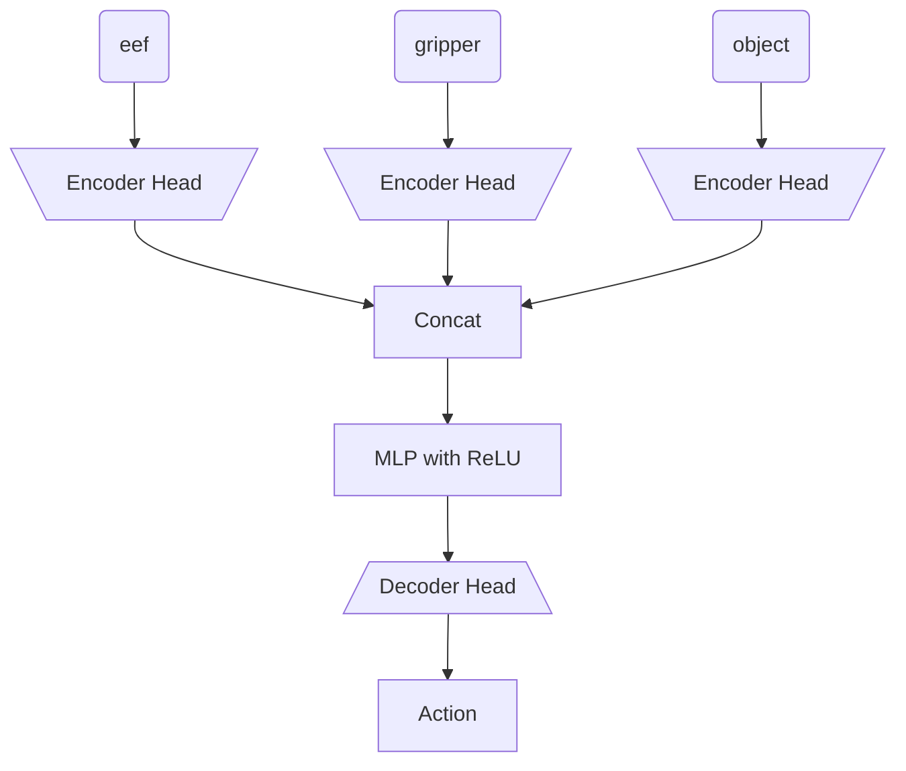
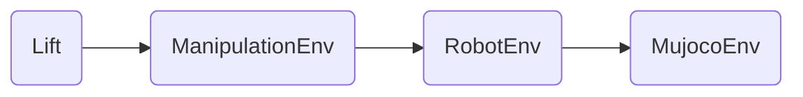

# Diffusion Policy Lift Task

[Diffusion Policy Codebase](https://github.com/real-stanford/diffusion_policy/tree/main/diffusion_policy)

Based on <i> lift_image.yaml </i> and it states that dataset comes from the robomimic dataset

---

# Robomimic

[Robomimic Codebase](https://github.com/ARISE-Initiative/robomimic)

After taking a look at RoboMimic, it seems that understanding this paper is essential for understanding how to do BC on a robot. I would recommend anyone getting into BC to read this paper deeply.

### Pre-Code Dive

[Paper link](https://arxiv.org/pdf/2108.03298)

Based on <i> README.md </i> 3/11/2025 robomimic datasets move to HuggingFace.

<b> IMPORTANT </b> from Robomimic, we see that randomizing object in ADDITION to randomizing robot state (by a little) matters in getting robust performance.

<b> IMPORTANT </b> from Robomimic, we see that BC-RNN performs better by a large margin against just BC (concatenate horizon of observations as features). 


<i> <b>Figure 1:</b> (MG) is machine generated. (PH) is proficient human. (MH) is multi-human. We can see that lift does really well in general. It is perfect for HUMAN demonstrations. However, it is much worse for machine-generated (MG). Either way, we should expect high performance in our task. </i>


The observation that (PH) and (MH) does better than (MG) is actually stated in the paper in their <b> C1 </b> remark. These (C#) remarks are claims they wish to validate.


> <b> (C1) Data from Non-Markovian Decision Process. </b> Human demonstrations can differ substantially
from machine-generated demonstrations because humans may not act purely based on a single current
observation. External factors (teleoperation device, past actions, history of episode) may all play a
role. Prior work [20] has noted substantial benefits from leveraging models that are history-dependent
and / or with temporal abstraction to learn from human demonstrations. We investigate various design
choices related to such architectures in this study.

This would also mean that for (MG) demos, using BC-RNN might not work.


> <b> (C3) Dependence on Dataset Size. </b> Offline policy learning is sensitive to the state and action space
coverage in the dataset, and by extension, the size of the dataset itself. In our study, we investigate
how dataset sizes affect policy performance. This analysis is useful to understand the value of adding
more data – an important consideration since collecting human demonstrations can be costly.

> <b> (C4) Mismatch between Training and Evaluation Objectives. </b> Unlike traditional supervised learning, where model selection can be achieved by using the model with the lowest validation loss [21],
offline policy learning often suffers from the fact that the training objective is only a surrogate for the
true objective of interest (e.g. task success rate), and policy performance can change significantly
from epoch to epoch. This makes it difficult to select the best trained model [19, 28, 29]. In our
study, we evaluate each policy checkpoint online in the environment in simulation, and report the best
policy success rate per training run. We use these ground-truth values to understand the effectiveness
of different selection criteria, and confirm that offline policy selection is an important problem,
especially in real-world scenarios where large-scale empirical evaluation is difficult.

<b> IMPORTANT BIG NOTE </b> (MG) is generated by running a SOTA RL Policy (from 2021) on these tasks. These literally take in one observation horizon and output an action. We should not trust the (MG) results on scripted demos.


These figures don't need much explaning. It just shows how different hyperparameter settings can change the policy's performance (mostly for the worse here).

Now we move into the appendix section of the paper because that is where the juicy pre-code details are.

#### Appendix Info

Policy outputs actions at a rate of 20Hz. Action space is in delta-pose form. Delta-rotation is axis-angle. 

> <b> Lift. </b> Object observations (10-dim) consist of the absolute cube position and cube quaternion (7-dim),
and the cube position relative to the robot end effector (3-dim). The cube pose is randomized at the
start of each episode with a random z-rotation in a small square region at the center of the table.

<b> Simulation Note: </b> All tasks were designed using MuJoCo and the robosuite framework. 

All of the simulation code is actually from robosuite codebase which wraps MuJoCo.

The action horizon was 1 by the way.

---

## Robomimic Code Dive

We start in <i> policy_nets.py </i>

### Policy Network
Our desired BC network implementation is written in <i> ActorNetwork </i> class. This is the inheritance graph for the class:



Here is my notes of the <b> implementation of ActorNetwork </b> where I remove some code and comments for clarity.
```python
class ActorNetwork(MIMO_MLP):
    """
    A basic policy network that predicts actions from observations.
    Can optionally be goal conditioned on future observations.
    """
    def __init__(self, obs_shapes, ac_dim, mlp_layer_dims, goal_shapes=None, encoder_kwargs=None):
        ''' AN NOTE:
        obs_shapes: OrderedDict(string, OrderedDict(string, tuple(int)))
            - string: observation key ('obs' or 'goal')
            - OrderedDict(string, tuple(int))
                - string: observation name ('object', 'eef_quat', 'eef_pos')
                - tuple(int): shape of observation (e.g. (3,), (7,), (10,))
        ac_dim: (int) action dim
        mlp_layer_dims ([int]): specify mlp layers
        '''
        assert isinstance(obs_shapes, OrderedDict)
        self.obs_shapes = obs_shapes
        self.ac_dim = ac_dim

        observation_group_shapes = OrderedDict()
        observation_group_shapes["obs"] = OrderedDict(self.obs_shapes)

        self._is_goal_conditioned = False
        if goal_shapes is not None and len(goal_shapes) > 0:
            assert isinstance(goal_shapes, OrderedDict)
            self._is_goal_conditioned = True
            self.goal_shapes = OrderedDict(goal_shapes)
            observation_group_shapes["goal"] = OrderedDict(self.goal_shapes)
        else:
            self.goal_shapes = OrderedDict()

        output_shapes = self._get_output_shapes()
        super(ActorNetwork, self).__init__(
            input_obs_group_shapes=observation_group_shapes,
            output_shapes=output_shapes,
            layer_dims=mlp_layer_dims,
            encoder_kwargs=encoder_kwargs,
        )
    def _get_output_shapes(self):
        return OrderedDict(action=(self.ac_dim,)) #AN NOTE: only output is action dim (horizon=1)
    def forward(self, obs_dict, goal_dict=None):
        # AN NOTE: actions calls forward from MIMO_MLP
        actions = super(ActorNetwork, self).forward(obs=obs_dict, goal=goal_dict)["action"]
        # apply tanh squashing to ensure actions are in [-1, 1]
        return torch.tanh(actions) #AN NOTE: why does it run tanh here?
```

For the most part, everything makes sense (and maybe too much is abstracted.)

I think I don't quite get why <i> torch.tanh(actions) </i> is such a good idea.
While it squashes actions down to [-1, 1], it 's a nonlinear mapping. I guess if the network can learn anything, the tanh just serves to restrict the action space.

Now we move to the <b> implementation of MIMO_MLP </b>.

```python
class MIMO_MLP(Module):
    """
    Extension to MLP to accept multiple observation dictionaries as input and
    to output dictionaries of tensors. Inputs are specified as a dictionary of 
    observation dictionaries, with each key corresponding to an observation group.

    This module utilizes @ObservationGroupEncoder to process the multiple input dictionaries and

    @ObservationDecoder to generate tensor dictionaries. The default behavior
    for encoding the inputs is to process visual inputs with a learned CNN and concatenating
    the flat encodings with the other flat inputs. The default behavior for generating 
    outputs is to use a linear layer branch to produce each modality separately
    (including visual outputs).
    """
    def __init__(
        self,
        input_obs_group_shapes,
        output_shapes,
        layer_dims,
        layer_func=nn.Linear, 
        activation=nn.ReLU,
        encoder_kwargs=None,
    ):
        """
        Args:
            input_obs_group_shapes (OrderedDict): a dictionary of dictionaries.
                Each key in this dictionary should specify an observation group, and
                the value should be an OrderedDict that maps modalities to
                expected shapes.
            output_shapes (OrderedDict): a dictionary that maps modality to
                expected shapes for outputs.
            layer_dims ([int]): sequence of integers for the MLP hidden layer sizes
            layer_func: mapping per MLP layer - defaults to Linear
            activation: non-linearity per MLP layer - defaults to ReLU
        """
        super(MIMO_MLP, self).__init__()
        self.input_obs_group_shapes = input_obs_group_shapes
        self.output_shapes = output_shapes
        self.nets = nn.ModuleDict()
        # Encoder for all observation groups.
        self.nets["encoder"] = ObservationGroupEncoder(
            observation_group_shapes=input_obs_group_shapes,
            encoder_kwargs=encoder_kwargs,
        )
        # flat encoder output dimension
        mlp_input_dim = self.nets["encoder"].output_shape()[0]
        # intermediate MLP layers
        self.nets["mlp"] = MLP(
            input_dim=mlp_input_dim,
            output_dim=layer_dims[-1],
            layer_dims=layer_dims[:-1],
            layer_func=layer_func,
            activation=activation,
            output_activation=activation, # make sure non-linearity is applied before decoder
        )
        # decoder for output modalities
        self.nets["decoder"] = ObservationDecoder(
            decode_shapes=self.output_shapes,
            input_feat_dim=layer_dims[-1],
        )

    def output_shape(self, input_shape=None):
        return { k : list(self.output_shapes[k]) for k in self.output_shapes }

    def forward(self, **inputs):
        enc_outputs = self.nets["encoder"](**inputs)
        mlp_out = self.nets["mlp"](enc_outputs)
        return self.nets["decoder"](mlp_out)
```

Based on this code, the BC network looks like this:

For the decode head it runs an <i> nn.Linear </i> from the output of the MLP to the action space. Not going to include <i> ObservationDecoder </i> because of my summary.

Actualy it could just be concatenation for state-based BC. It only runs encoder head for RGB observations (see <i> create_obs_encoder </i>).

<b> NOTE </b> The difference between this and mine is that I concatenate the observations beforehand (no encoder heads).

### Training/Sim Details (Action Space)

I think we dug enough into how the <i> ActorNetwork </i> is implemented for us. Now we want to see how it is used in the training loop (and inference time).

This is the loss function computed in the <i> BC </b> class which uses <i> ActorNetwork </i>.

```python
    def _compute_losses(self, predictions, batch):
        """
        Internal helper function for BC algo class. Compute losses based on
        network outputs in @predictions dict, using reference labels in @batch.

        Args:
            predictions (dict): dictionary containing network outputs, from @_forward_training
            batch (dict): dictionary with torch.Tensors sampled
                from a data loader and filtered by @process_batch_for_training

        Returns:
            losses (dict): dictionary of losses computed over the batch
        """
        losses = OrderedDict()
        a_target = batch["actions"]
        actions = predictions["actions"]
        losses["l2_loss"] = nn.MSELoss()(actions, a_target)
        losses["l1_loss"] = nn.SmoothL1Loss()(actions, a_target)
        # cosine direction loss on eef delta position
        losses["cos_loss"] = LossUtils.cosine_loss(actions[..., :3], a_target[..., :3])

        action_losses = [
            self.algo_config.loss.l2_weight * losses["l2_loss"],
            self.algo_config.loss.l1_weight * losses["l1_loss"],
            self.algo_config.loss.cos_weight * losses["cos_loss"],
        ]
        action_loss = sum(action_losses)
        losses["action_loss"] = action_loss
        return losses
```

As we can see, the loss function is as follows:

$$
\begin{equation}
\mathcal{L} = \lambda_1 \mathcal{L}_{l2} + \lambda_2 \mathcal{L}_{l1} + \lambda_3 \mathcal{L}_{cos}
\end{equation}
$$

where $$\mathcal{L}_{cos}$$ is cosine similarity loss. This is added on top of the MSE (I am only using this) and L1 loss.

If we tried to figure out how the neural network action is used, we won't find it in this codebase (sadly). It is all abstracted away in a <i> .step() </i> function within <i> run_rollout() </i> which is where the <i> BC </i> class is deployed. The notion of action is just a tensor that is passed around.

In order to understand how the action is used, we need to dig into robosuite, to see how it handles its action space!

---

## Robosuite Code Dive

[Robosuite Codebase](https://github.com/ARISE-Initiative/robosuite)

It seems that robosuite has a Lift Task! It is actually a manipulation environment that we can take a look at.

<b> NOTE </b> if we want to just use someone else's environment, keep note that robosuite is the codebase that defines all the environments we are benchmarking against. It is a wrapper around MuJoCo.

This is the inheritance graph for <i> Lift </i> class:



It seems all of the details of how action is handled is within the <i> RobotEnv </i> class.


```python
    def _pre_action(self, action, policy_step=False):
        """
        Overrides the superclass method to control the robot(s) within this enviornment using their respective
        controllers using the passed actions and gripper control.

        Args:
            action (np.array): The control to apply to the robot(s). Note that this should be a flat 1D array that
                encompasses all actions to be distributed to each robot if there are multiple. For each section of the
                action space assigned to a single robot, the first @self.robots[i].controller.control_dim dimensions
                should be the desired controller actions and if the robot has a gripper, the next
                @self.robots[i].gripper.dof dimensions should be actuation controls for the gripper.
            policy_step (bool): Whether a new policy step (action) is being taken

        Raises:
            AssertionError: [Invalid action dimension]
        """
        # Verify that the action is the correct dimension
        assert len(action) == self.action_dim, "environment got invalid action dimension -- expected {}, got {}".format(
            self.action_dim, len(action)
        )

        # Update robot joints based on controller actions
        cutoff = 0
        for idx, robot in enumerate(self.robots):
            robot_action = action[cutoff : cutoff + robot.action_dim]
            robot.control(robot_action, policy_step=policy_step)
            cutoff += robot.action_dim
```

I don't know what this pre-action is but it seems that it could be overriding the controller???? and just setting the robot position. 

According to <i> robosuite/environments/base.py </i> line 483 in the definition of <i> _pre_action </i>:
```python
def _pre_action(self, action, policy_step=False):
    """
    Do any preprocessing before taking an action.
    Args:
        action (np.array): Action to execute within the environment
        policy_step (bool): Whether this current loop is an actual policy step or internal sim update step
    """
    self.sim.data.ctrl[:] = action
```
which means that this code does get run and will change the robot! 

Note that the robot state change comes from <i> robot.control </i>, so we can investigate that.

We find an implementation of <i> control </i> in <i> robosuite/robots/fixed_base_robots.py </i>

```python
def control(self, action, policy_step=False):
    """
    Actuate the robot with the
    passed joint velocities and gripper control.

    Args:
        action (np.array): The control to apply to the robot. The first @self.robot_model.dof dimensions should
            be the desired normalized joint velocities and if the robot has a gripper, the next @self.gripper.dof
            dimensions should be actuation controls for the gripper.

            :NOTE: Assumes inputted actions are of form:
                [right_arm_control, right_gripper_control, left_arm_control, left_gripper_control]

        policy_step (bool): Whether a new policy step (action) is being taken
    """
    # clip actions into valid range
    assert len(action) == self.action_dim, "environment got invalid action dimension -- expected {}, got {}".format(
        self.action_dim, len(action)
    )

    self.composite_controller.update_state()
    if policy_step:
        self.composite_controller.set_goal(action)

    applied_action_dict = self.composite_controller.run_controller(self._enabled_parts)
    for part_name, applied_action in applied_action_dict.items():
        applied_action_low = self.sim.model.actuator_ctrlrange[self._ref_actuators_indexes_dict[part_name], 0]
        applied_action_high = self.sim.model.actuator_ctrlrange[self._ref_actuators_indexes_dict[part_name], 1]
        applied_action = np.clip(applied_action, applied_action_low, applied_action_high)
        self.sim.data.ctrl[self._ref_actuators_indexes_dict[part_name]] = applied_action

    if policy_step:
        # Update proprioceptive values
        self.recent_qpos.push(self._joint_positions)
        self.recent_actions.push(action)
        self.recent_torques.push(self.torques)

        for arm in self.arms:
            controller = self.part_controllers[arm]
            # Update arm-specific proprioceptive values
            self.recent_ee_forcetorques[arm].push(np.concatenate((self.ee_force[arm], self.ee_torque[arm])))
            self.recent_ee_pose[arm].push(np.concatenate((controller.ref_pos, T.mat2quat(controller.ref_ori_mat))))
            self.recent_ee_vel[arm].push(np.concatenate((controller.ref_pos_vel, controller.ref_ori_vel)))

            # Estimation of eef acceleration (averaged derivative of recent velocities)
            self.recent_ee_vel_buffer[arm].push(np.concatenate((controller.ref_pos_vel, controller.ref_ori_vel)))
            diffs = np.vstack(
                [
                    self.recent_ee_acc[arm].current,
                    self.control_freq * np.diff(self.recent_ee_vel_buffer[arm].buf, axis=0),
                ]
            )
            ee_acc = np.array([np.convolve(col, np.ones(10) / 10.0, mode="valid")[0] for col in diffs.transpose()])
            self.recent_ee_acc[arm].push(ee_acc)
```
We see that this actually runs a controller (most likely OSC) and then gives out an "action" which is actually just torques to apply on the robot. 

So in reality, the <i> _pre_action </i> is the action code.

Now, we can take a look at the controller code. This is located in <i> robosuite/controllers/parts/arm/osc.py </i>. 

```python
def set_goal(self, action):
    """
    Sets goal based on input @action. If self.impedance_mode is not "fixed", then the input will be parsed into the
    delta values to update the goal position / pose and the kp and/or damping_ratio values to be immediately updated
    internally before executing the proceeding control loop.

    Note that @action expected to be in the following format, based on impedance mode!

        :Mode `'fixed'`: [joint pos command]
        :Mode `'variable'`: [damping_ratio values, kp values, joint pos command]
        :Mode `'variable_kp'`: [kp values, joint pos command]

    Args:
        action (Iterable): Desired relative joint position goal state
    """
    # Update state
    self.update()

    # Parse action based on the impedance mode, and update kp / kd as necessary
    if self.impedance_mode == "variable":
        damping_ratio, kp, delta = action[:6], action[6:12], action[12:]
        self.kp = np.clip(kp, self.kp_min, self.kp_max)
        self.kd = 2 * np.sqrt(self.kp) * np.clip(damping_ratio, self.damping_ratio_min, self.damping_ratio_max)
    elif self.impedance_mode == "variable_kp":
        kp, delta = action[:6], action[6:]
        self.kp = np.clip(kp, self.kp_min, self.kp_max)
        self.kd = 2 * np.sqrt(self.kp)  # critically damped
    else:  # This is case "fixed"
        delta = action

    # If we're using deltas, interpret actions as such
    if self.input_type == "delta":
        scaled_delta = self.scale_action(delta)
        self.goal_pos = self.compute_goal_pos(scaled_delta[0:3])
        if self.use_ori is True:
            self.goal_ori = self.compute_goal_ori(scaled_delta[3:6])
        else:
            self.goal_ori = self.compute_goal_ori(np.zeros(3))
    # Else, interpret actions as absolute values
    elif self.input_type == "absolute":
        self.goal_pos = action[0:3]
        if self.use_ori is True:
            self.goal_ori = Rotation.from_rotvec(action[3:6]).as_matrix()
        else:
            self.goal_ori = self.compute_goal_ori(np.zeros(3))
    else:
        raise ValueError(f"Unsupport input_type {self.input_type}")
    ... # AN CUTOFF
```
We can see that when <i> input_type == "delta" </i>, it computes the new rotation matrix given a delta rather than just wrap a rotation instance around the action. 

If we really want to get specific, we can look at <i> self.compute_goal_ori </i>
```python
    def compute_goal_ori(self, delta, goal_update_mode=None):
        """
        Compute new goal orientation, given a delta to update. Can either update the new goal based on
        current achieved position or current deisred goal. Updating based on current deisred goal can be useful
        if we want the robot to adhere with a sequence of target poses as closely as possible,
        without lagging or overshooting.

        Args:
            delta (np.array): Desired relative change in orientation, in axis-angle form [ax, ay, az]
            goal_update_mode (str): either "achieved" (achieved position) or "desired" (desired goal)

        Returns:
            np.array: updated goal orientation in the controller frame
        """
        if goal_update_mode is None:
            goal_update_mode = self._goal_update_mode
        assert goal_update_mode in ["achieved", "desired"]

        if self.goal_ori is None:
            # if goal is not already set, set it to current orientation (in controller ref frame)
            if self.input_ref_frame == "base":
                self.goal_ori = self.goal_origin_to_eef_pose()[:3, :3]
            elif self.input_ref_frame == "world":
                self.goal_ori = self.ref_ori_mat
            else:
                raise ValueError

        # convert axis-angle value to rotation matrix
        quat_error = T.axisangle2quat(delta) #AN NOTE: this is the moneymaker
        rotation_mat_error = T.quat2mat(quat_error)

        if self._goal_update_mode == "desired":
            # update new goal wrt current desired goal
            goal_ori = np.dot(rotation_mat_error, self.goal_ori)
        elif self._goal_update_mode == "achieved":
            # update new goal wrt current achieved orientation
            if self.input_ref_frame == "base":
                curr_goal_ori = self.goal_origin_to_eef_pose()[:3, :3]
            elif self.input_ref_frame == "world":
                curr_goal_ori = self.ref_ori_mat
            else:
                raise ValueError
            goal_ori = np.dot(rotation_mat_error, curr_goal_ori) #AN NOTE: this is the moneymaker
        else:
            raise ValueError

        # AN REDACTED

        return goal_ori
```
We can see in the definition of <i> goal_ori </i> how delta is utilized. Additionally, we know that the delta is angleaxis representation in the instantiation of <i> quat_error </i> where it uses <i> T.axisangle2quat(delta) </i> to convert it from axisangle to a quaternion.

This confirms that the action space is in delta-poses and uses axis-angle for rotation representation.

---

### Checking out Robomimic's dataset

Next implementation detail that we need to understand is how the dataset is recorded.