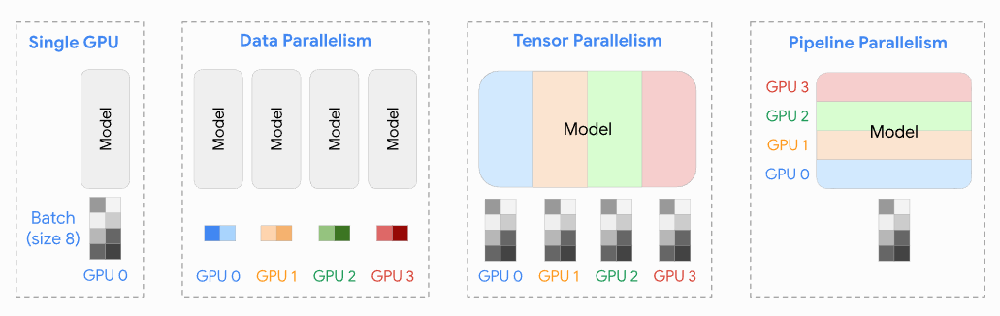
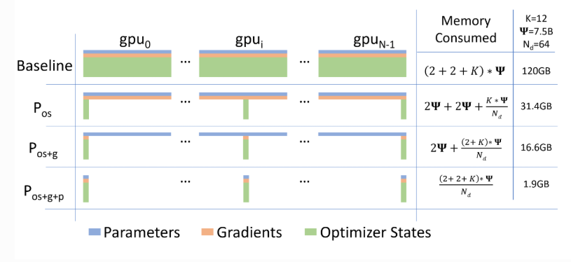
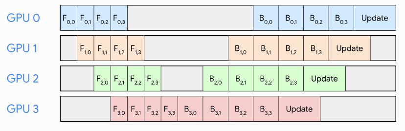
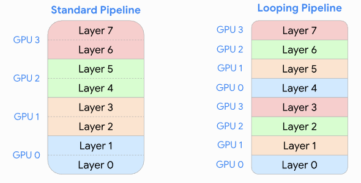
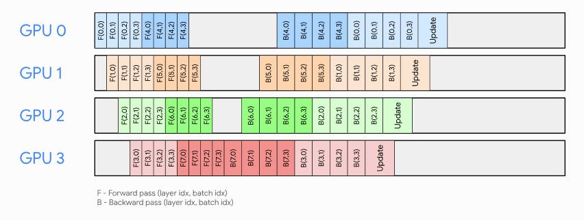
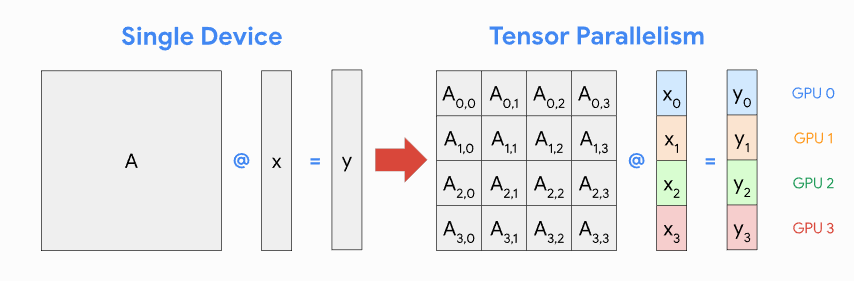
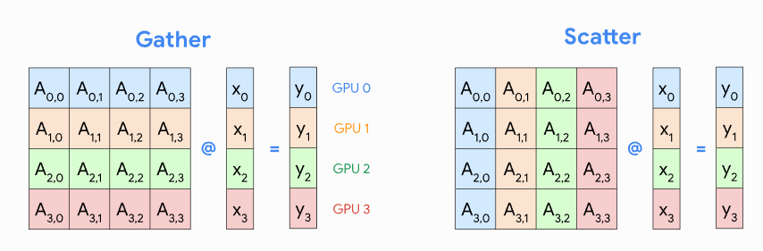

# Distributed Compute in Deep Learning

In this note, we will cover the use of multiple GPUs in deep learning. This will help us extract the most performance out of our hardware. 

## 1. Different types of Parallelisms

### 1.1 Data Parallelism:

This is the most common type of parallelism. We split the data across 4 GPUs and each GPU will then compute gradients for its own subset of data. We accumulate these gradients across all GPU devices and update our model parameters. In a sense, this allows us to calculate gradients on larger batches and reduce the time it takes to update our model parameters. 

<b> NOTE: </b> this requires us to have a copy of the model parameters on each GPU device.

We can also do **Parameter Sharding** where we shard our model parameters across multiple GPUs. We must then communicate the model parameters across these GPUs to calculate each batch. We also communicate the gradients back to the original GPU that has the model parameters. There are other things we can shard as is done with the ZeRO optimizer such as gradients and optimizer states. 

this is a visual of what we mean by parameters sharding. "os" is optimizer state, "g" is gradients, and "p" is parameters.

Use Cases:
- large model sizes
- large batches to process

While Parameter Sharding is great, take note that it requires us to communicate between GPUs. This overhead for large enough models can be a bottleneck. Additionally, with larger data that uses smaller batch sizes, there's not much benefit in doing Data Parallelism in general.

### 1.2 Pipeline Parallelism:

Another way of parallelizing our model is to parallelize the forward/backward pass of our model itself. 

**Micro-batching**: we can achieve pipeline parallelism through by splitting our input batch into micro-batches and processing them sequentially. While it is sequential, don't be fooled. We are processing multiple micro-batches at the same time but they are in different stages of the model. The same is done in the backward pass. 

You can actually see that there is a lot of time wasted because of the sequential nature of this process. GPU 3 is waiting for GPU 2 to finish which waits for the previous GPUs to finish. Can we reduce the time it takes for GPU 3 to wait for GPU 2?

We can do this through **Looping Pipelines**.

As we can see, instead of having a GPU hold a larger sequential portion of the model, we let it have a smaller portion of different parts as shown in the diagram. This reduces the "stage execution time" of the GPU and reduces the waiting time bottleneck that we discussed. 

We can see the difference between this and the previous naive pipeline parallelism.

### 1.3 Tensor Parallelism:

Tensor parallelism also parallelizes the model. However, it differs by parallelizing the model weights along the feature dimensions. This is way trickier to implement, but it will allow us to get around the stage execution time bottleneck that we saw in the previous pipeline parallelism. 

Above is a figure showing the non-trivial issue of tensor parallelism. We need to figure out how to assign the gray cells to a GPU. 

As you can see $$A_{0,i}$$ row needs to multiply with $$x_0,x_1,x_2,x_3$$ which are in different GPUs, so we can infer that communication between GPUs is required.

Should $$A_{0,i}$$ be assigned to GPU 0 (gather) or should it be split across GPUs (scatter)? This is the crux of tensor parallelism.

A visual representation of the scatter-gather operation is shown below.

Gather strategy is better when input dimension is much larger than output dimension. Scatter strategy is better when input dimension is much smaller than output dimension.

We choose whether to gather or scatter per layer.

**NOTE:**: 3D Parallelism is a combination of data parallelism, pipeline parallelism, and tensor parallelism. This is done to train LLMs.