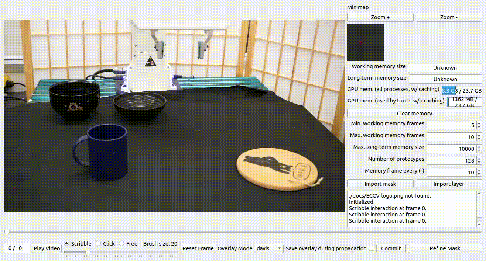

## GROOT Dataset Format

Processing a single hdf5 file with the following structure:

```python
{
    "data": {
        "demo_0": {
            "actions": (T, A),
            "obs": {
                "agentview_rgb": (T, H, W, 3),
                "agentview_depth": (T, H, W),
                "agentview_masks": (T, H1, W1),
                "agentview_extrinsics": (T, 4, 4),
                "ee_states": (T, 16),
                "gripper_states": (T, 1)
            }
        }
    }
}
```

This is how to access the code. I put it in the form of print statements:
```python
with h5py.File(example_demo_file) as f:
    print(f'f["data"]: {f["data"]}')
    print(f'f["data"].keys(): {f["data"].keys()}')
    print(f'f["data/demo_0"].keys(): {f["data/demo_0"].keys()}')
    print(f'f["data/demo_0/actions"].shape (T,A): {np.array(f["data/demo_0/actions"]).shape}')
    
    print(f'f["data/demo_0/obs"].keys(): {f["data/demo_0/obs"].keys()}')
    print(f'f["data/demo_0/obs"]["agentview_rgb"].shape (T, H, W, 3): {f["data/demo_0/obs"]["agentview_rgb"].shape}')
    print(f'f["data/demo_0/obs"]["agentview_depth"].shape (T, H, W): {f["data/demo_0/obs"]["agentview_depth"].shape}')
    print(f'f["data/demo_0/obs"]["agentview_masks"].shape (T, H1, W1): {f["data/demo_0/obs"]["agentview_masks"].shape}')
    print(f'f["data/demo_0/obs"]["agentview_extrinsics"].shape (T, 4, 4): {f["data/demo_0/obs"]["agentview_extrinsics"].shape}')
    print(f'f["data/demo_0/obs"]["ee_states"].shape (T, 16): {f["data/demo_0/obs"]["ee_states"].shape}')
    print(f'f["data/demo_0/obs"]["gripper_states"].shape (T, 1): {f["data/demo_0/obs"]["gripper_states"].shape}')
```

Code output:
```
f["data"]: <HDF5 group "/data" (1 members)>
f["data"].keys(): <KeysViewHDF5 ['demo_0']>
f["data/demo_0"].keys(): <KeysViewHDF5 ['actions', 'obs']>
f["data/demo_0/actions"].shape (T,A): (165, 7)
f["data/demo_0/obs"].keys(): <KeysViewHDF5 ['agentview_depth', 'agentview_extrinsics', 'agentview_masks', 'agentview_rgb', 'ee_states', 'gripper_states', 'joint_states']>
f["data/demo_0/obs"]["agentview_rgb"].shape (T, H, W, 3): (165, 224, 224, 3)
f["data/demo_0/obs"]["agentview_depth"].shape (T, H, W): (165, 224, 224)
f["data/demo_0/obs"]["agentview_masks"].shape (T, H1, W1): (165, 480, 480)
f["data/demo_0/obs"]["agentview_extrinsics"].shape (T, 4, 4): (165, 4, 4)
f["data/demo_0/obs"]["ee_states"].shape (T, 16): (165, 16)
f["data/demo_0/obs"]["gripper_states"].shape (T, 1): (165, 1)
```

## LIBERO Dataset Format

Processing a single hdf5 file with the following structure:
The difference we notice is that in LIBERO, it is missing the following observation keys:
- agentview_depth (normalized depth data, can get from env) NOTE: GROOT O3DPointCloud will handle unnormalization
- agentview_extrinsics (camera extrinsic matrix, can get from env)
- agentview_masks (segmentation masks of objects, must use XMem + Annotation, last mask is the robot)

Additionally, demos here have more stuff to work with:
- rewards (for RL)
- robot_states
- states (used to replay benchmark and get other modalities if we need)

```python
{
    "data": {
        "demo_0": {
            "actions": (T, A),
            "obs": {
                "agentview_rgb": (T, H, W, 3),
                "ee_states": (T, 16),
                "gripper_states": (T, 1)
            }
        }
    }
}
```

```python
with h5py.File(demo_file, 'r') as f:
    print(f'f["data"]: {f["data"]}')
    print(f'f["data"].keys(): {f["data"].keys()}')
    print(f'f["data/demo_0"].keys(): {f["data/demo_0"].keys()}')
    print(f'f["data/demo_0/actions"].shape (T,A): {np.array(f["data/demo_0/actions"]).shape}')
    
    print(f'f["data/demo_0/obs"].keys(): {f["data/demo_0/obs"].keys()}')
    print(f'f["data/demo_0/obs"]["agentview_rgb"].shape (T, H, W, 3): {f["data/demo_0/obs"]["agentview_rgb"].shape}')
    print(f'f["data/demo_0/obs"]["ee_states"].shape (T, 16): {f["data/demo_0/obs"]["ee_states"].shape}')
    print(f'f["data/demo_0/obs"]["gripper_states"].shape (T, 1): {f["data/demo_0/obs"]["gripper_states"].shape}')
```

Code output:
```
f["data"]: <HDF5 group "/data" (50 members)>
f["data"].keys(): <KeysViewHDF5 ['demo_0', 'demo_1', 'demo_10', 'demo_11', 'demo_12', 'demo_13', 'demo_14', 'demo_15', 'demo_16', 'demo_17', 'demo_18', 'demo_19', 'demo_2', 'demo_20', 'demo_21', 'demo_22', 'demo_23', 'demo_24', 'demo_25', 'demo_26', 'demo_27', 'demo_28', 'demo_29', 'demo_3', 'demo_30', 'demo_31', 'demo_32', 'demo_33', 'demo_34', 'demo_35', 'demo_36', 'demo_37', 'demo_38', 'demo_39', 'demo_4', 'demo_40', 'demo_41', 'demo_42', 'demo_43', 'demo_44', 'demo_45', 'demo_46', 'demo_47', 'demo_48', 'demo_49', 'demo_5', 'demo_6', 'demo_7', 'demo_8', 'demo_9']>
f["data/demo_0"].keys(): <KeysViewHDF5 ['actions', 'dones', 'obs', 'rewards', 'robot_states', 'states']>
f["data/demo_0/actions"].shape (T,A): (148, 7)
f["data/demo_0/obs"].keys(): <KeysViewHDF5 ['agentview_rgb', 'ee_ori', 'ee_pos', 'ee_states', 'eye_in_hand_rgb', 'gripper_states', 'joint_states']>
f["data/demo_0/obs"]["agentview_rgb"].shape (T, H, W, 3): (148, 128, 128, 3)
f["data/demo_0/obs"]["ee_states"].shape (T, 16): (148, 6)
f["data/demo_0/obs"]["gripper_states"].shape (T, 1): (148, 2)
```

## Dataset Format Comparison:
With this comparison, it is clear we need to need to re-render LIBERO and get the following observations:
- agentview_depth (unnormalized depth)
- agentview_masks (segmentation masks)

## Use annotation to get masks



Afterwards, we use the annotations and XMem to get ```agentview_masks```. This allows us to track any object in the scene.

## Training GROOT

Preparing the GROOT dataset requires the use of Point-MAE, which is completely incompatible with our current anaconda environment. Even using Point-MAE requires really old versioning. This is fucked up.

### Current conflicts

- Point-MAE_ops requires torch to use CUDA 12.4 (system cuda), DinoV2 requires torch to use CUDA 11.7
- We can't use CUDA 11.7 because desktop is on CUDA 12.4