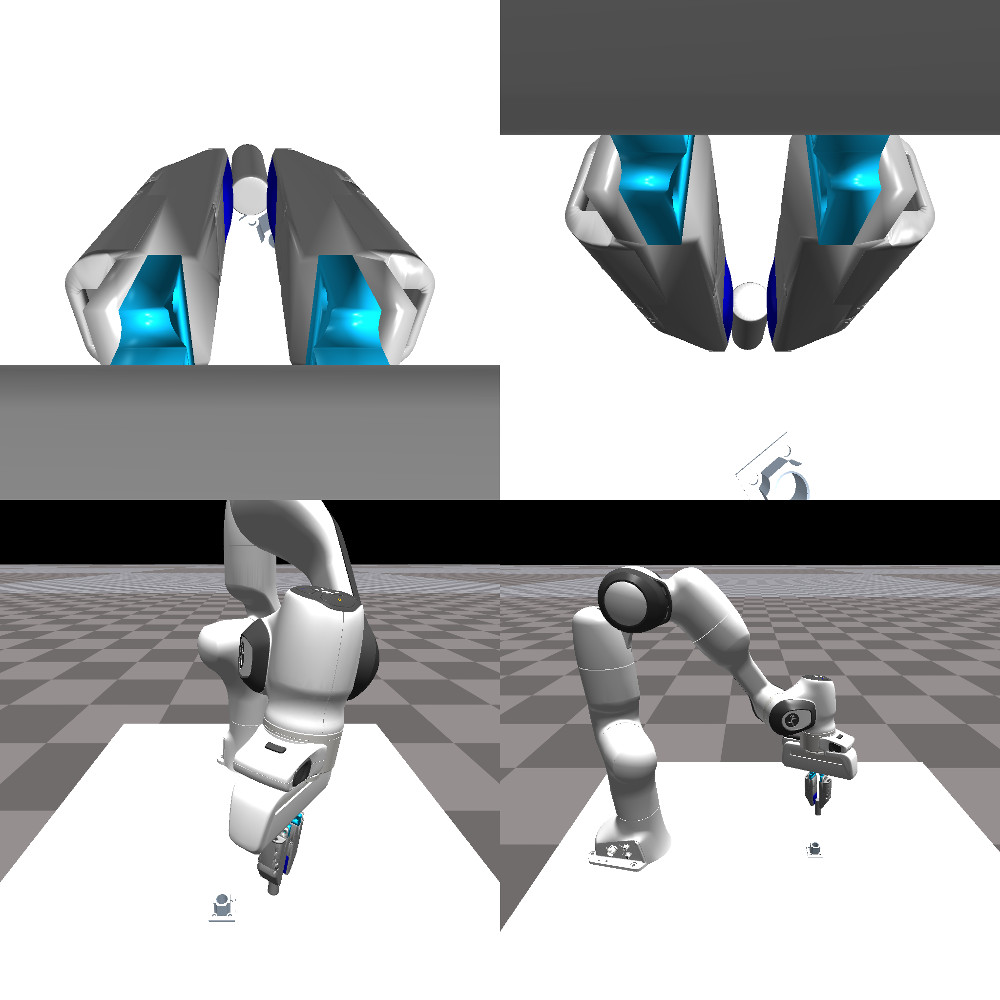
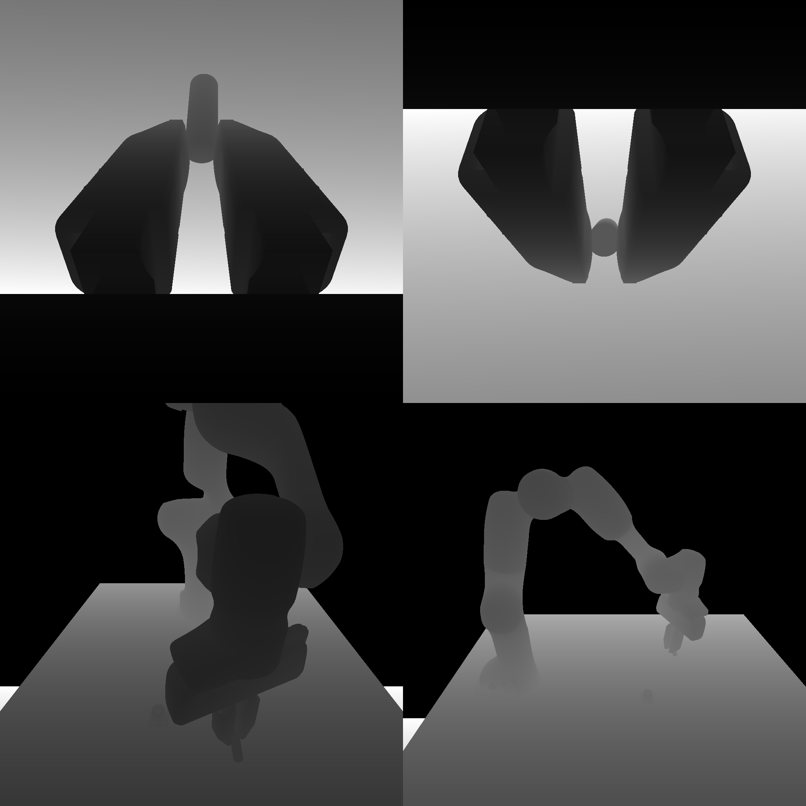
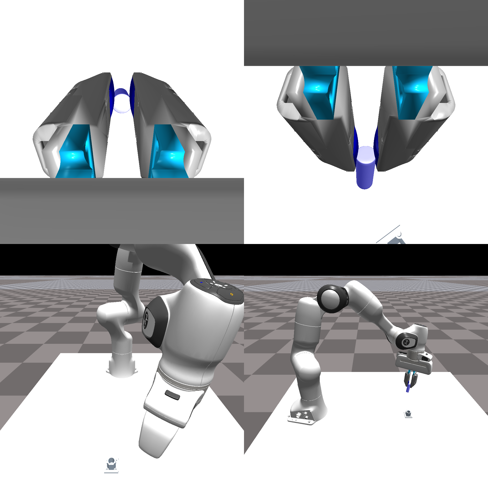
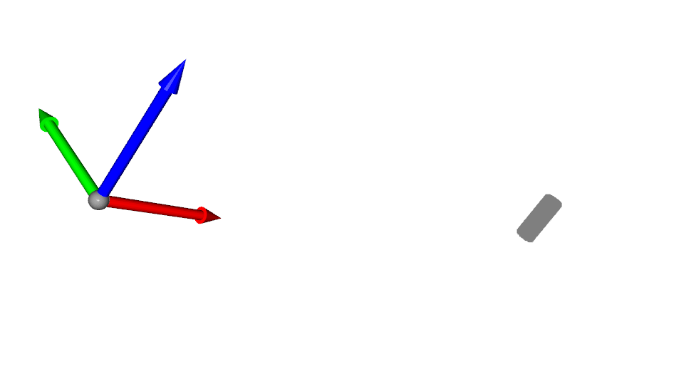

# 2. Understanding how cameras work in IsaacGymEnv

## 2.1 Camera creation and access

Cameras are created in isaacgym using `gym.create_camera_sensor`. where `gym = gymapi.acquire_gym()`. This is embedded into `isaacgymenvs/tacsl_sensors/tacsl_sensors.py` in `CameraSensor.setup_env_cameras`.

```python
def setup_env_cameras(self, env_ptr, camera_spec_dict):
    """
    Set up environment cameras.

    Args:
        env_ptr: Pointer to the environment.
        camera_spec_dict (dict): Dictionary of camera specifications.

    Returns:
        dict: Dictionary of camera handles.
    """
    camera_handles = {}
    for name, camera_spec in camera_spec_dict.items():
        camera_properties = gymapi.CameraProperties()
        ... # setup camera_properties using camera_spec
        camera_handle = self.isaac_gym.create_camera_sensor(env_ptr, camera_properties)
        camera_handles[name] = camera_handle
        print(f'Created camera {name} with handle {camera_handle} for env {env_ptr}')

        
        if camera_spec.is_body_camera:
            ... # extra handling if camera is placed on a rigid body that moves
        else:
            transform = gymapi.Transform(gymapi.Vec3(*camera_spec.camera_pose[0]),
                                            gymapi.Quat(*camera_spec.camera_pose[1]))
            self.isaac_gym.set_camera_transform(camera_handle, env_ptr, transform)
            # sets camera transform in the environment
    # Return a dictionary of camera handles for each camera
    return camera_handles
```

Now the real question is how do you get `camera_spec_dict`? And what is inside of `camera_spec`?

We understand this by looking at calls of `setup_env_cameras`. This is also located in `CameraSensors.create_camera_actors`:

```python
class CameraSensor:/home/andang/workspace/isaac/IsaacGymEnvs/isaacgymenvs/camera_fused.png
    def create_camera_actors(self, camera_spec_dict, env_idx):
        ...
        env_camera_handles = self.setup_env_cameras(env_ptr, camera_spec_dict)
        ...
```

and `create_camera_actors` is called in `tacsl_env_insertion` at `_create_sensors`:

```python
def _create_sensors(self):
    self.camera_spec_dict = dict()
    self.camera_handles_list = []
    self.camera_tensors_list = []
    if self.cfg_task.env.use_isaac_gym_tactile:
        tactile_sensor_configs = self._compose_tactile_image_configs()
        self.set_compliant_dynamics_for_tactile_sensors(tactile_sensor_configs)
        camera_spec_dict_tactile = self.get_tactile_rgb_camera_configs(tactile_sensor_configs)
        self.camera_spec_dict.update(camera_spec_dict_tactile)

    if self.cfg_task.env.use_camera:
        camera_spec_dict = self.get_regular_camera_specs()
        self.camera_spec_dict.update(camera_spec_dict)

    if self.camera_spec_dict:
        # tactile cameras created along with other cameras in create_camera_actors
        camera_handles_list, camera_tensors_list = self.create_camera_actors(self.camera_spec_dict)
        self.camera_handles_list += camera_handles_list
        self.camera_tensors_list += camera_tensors_list
    
    ... # just more code for shear stuff
```

We see that `self.camera_spec_dict` is constructed by adding two dicts from `self.get_regular_camera_specs()` and `self.get_tactile_rgb_camera_configs(tactile_sensor_configs)`.

Since I am more concerned with visual cameras and not tactile cameras, I will focus on `get_regular_camera_specs`. 

```python
class TacSLSensors(TactileFieldSensor, TactileRGBSensor, CameraSensor):
    def get_regular_camera_specs(self):
        camera_spec_dict = {}
        if self.cfg_task.env.use_camera:
            camera_spec_dict = {c_cfg.name: c_cfg for c_cfg in self.cfg_task.env.camera_configs}
        return camera_spec_dict
```

I used `pdb.set_trace()` to figure out what default cameras are set up for tacsl. The default camera configs defined by `camera_spec_dict` are shown as:

```python
{
    'wrist': {
        'name': 'wrist',
        'is_body_camera': True,
        'actor_name': 'franka',
        'attach_link_name': 'panda_hand',
        'image_size': [1024, 1024],
        'image_type': 'rgb',
        'horizontal_fov': 75.0,
        'camera_pose': [[0.045, 0, 0.04], [0.5, 0, 0.866, 0]]
    },
    'wrist_2': {
        'name': 'wrist_2',
        'is_body_camera': True,
        'actor_name': 'franka',
        'attach_link_name': 'panda_hand',
        'image_size': [1024, 1024],
        'image_type': 'rgb',
        'horizontal_fov': 75.0,
        'camera_pose': [[-0.045, 0, 0.04], [0.866, 0, 0.5, 0]]
    },
    'front': {
        'name': 'front',
        'is_body_camera': False,
        'actor_name': None,
        'attach_link_name': None,
        'image_size': [1024, 1024],
        'image_type': 'rgb',
        'horizontal_fov': 75.0,
        'camera_pose': [[0.8, 0.0, 0.5], [-0.258819045, 1.58480958e-17, 0.965925826, 5.91458986e-17]]
    },
    'side': {
        'name': 'side',
        'is_body_camera': False,
        'actor_name': None,
        'attach_link_name': None,
        'image_size': [1024, 1024],
        'image_type': 'rgb',
        'horizontal_fov': 75.0,
        'camera_pose': [[0.3, -0.6797, 0.7099], [-0.1830127, 0.1830127, 0.6830127, 0.6830127]]
    }
}
```

As we can see, there are 4 cameras. There are 2 wrist cameras and 2 external cameras. I'll visualize what these cameras output using opencv.

By the way, these camera configs are located in `isaacgymenvs/cfg/task/TacSLTaskInsertion.yaml`. We can add cameras and modify there. 



Note that the current setup uses only RGB. 

## 2.2 Getting Object Point Clouds from Cameras

There is no code that uses depth in this codebase, I'm going to change that. First step is to add depth image and segmentation cameras. I modify `isaacgymenvs/cfg/task/TacSLTaskInsertion.yaml` to add depth and segmentation cameras. Here's an example:

```python
    - name: wrist
        is_body_camera: True
        actor_name: franka
        attach_link_name: panda_hand
        image_size: [1024, 1024]
        image_type: all
        horizontal_fov: 75.0
        camera_pose: [[0.045, 0, 0.04], [0.5, 0, 0.866, 0]]
```

We change `image_type` to `all` to get RGB, depth, and segmentation images. This now means we have to modify `isaacgymenvs/tacsl_sensors/tacsl_sensors.py` to handle the new image types.


We start off with `create_tensors_for_env_cameras` in `CameraSensor`:

```python
def create_tensors_for_env_cameras(self, env_ptr, env_camera_handles, camera_spec_dict):
    env_camera_tensors = {}
    for name in env_camera_handles:
        camera_handle = env_camera_handles[name]
        ...
        elif camera_spec_dict[name].image_type == 'all':
            # obtain camera tensor
            camera_tensor = self.gym.get_camera_image_gpu_tensor(self.sim, env_ptr, camera_handle,
                                                                    gymapi.IMAGE_COLOR)
            camera_tensor_depth = self.gym.get_camera_image_gpu_tensor(self.sim, env_ptr, camera_handle,
                                                                    gymapi.IMAGE_DEPTH)
            camera_tensor_seg = self.gym.get_camera_image_gpu_tensor(self.sim, env_ptr, camera_handle,
                                                                    gymapi.IMAGE_SEGMENTATION)
            torch_camera_tensor = gymtorch.wrap_tensor(camera_tensor)
            torch_camera_tensor_depth = gymtorch.wrap_tensor(camera_tensor_depth)
            torch_camera_tensor_seg = gymtorch.wrap_tensor(camera_tensor_seg)
            env_camera_tensors[name] = torch_camera_tensor
            env_camera_tensors[name + '_depth'] = torch_camera_tensor_depth
            env_camera_tensors[name + '_seg'] = torch_camera_tensor_seg
            continue
        ...
    return env_camera_tensors
```

We can still keep `env_camera_tensors` structure mostly the same but just add extra keys for depth and segmentation. Next up, we modify `get_camera_image_tensors_dict` in `CameraSensor` to handle the new image types:

```python
def get_camera_image_tensors_dict(self):
    """
    Get the dictionary of camera image tensors.

    Returns:
        dict: Dictionary of camera image tensors.
    """
    # transforms and information must be communicated from the physics simulation into the graphics system
    if self.device != 'cpu':
        self.gym.fetch_results(self.sim, True)
    self.gym.step_graphics(self.sim)

    self.gym.render_all_camera_sensors(self.sim)
    self.gym.start_access_image_tensors(self.sim)

    camera_image_tensors_dict = dict()

    for name in self.camera_spec_dict:
        camera_spec = self.camera_spec_dict[name]
        ... # other cases for handling image types
        elif camera_spec['image_type'] == 'all':
            
            ## RGB save
            num_channels = 3
            camera_images = torch.zeros(
                (self.num_envs, camera_spec.image_size[0], camera_spec.image_size[1], num_channels),
                device=self.device, dtype=torch.uint8)
            for id in np.arange(self.num_envs):
                camera_images[id] = self.camera_tensors_list[id][name][:, :, :num_channels].clone()
            camera_image_tensors_dict[name] = camera_images
            
            ## Depth save        
            num_channels = 1
            camera_images = torch.zeros(
                (self.num_envs, camera_spec.image_size[0], camera_spec.image_size[1]),
                device=self.device, dtype=torch.float)
            for id in np.arange(self.num_envs):
                # Note that isaac gym returns negative depth
                # See: https://carbon-gym.gitlab-master-pages.nvidia.com/carbgym/graphics.html?highlight=image_depth#camera-image-types
                camera_images[id] = self.camera_tensors_list[id][name][:, :].clone() * -1.
                camera_images[id][camera_images[id] == np.inf] = 0.0
            camera_image_tensors_dict[name + '_depth'] = camera_images
            
            ## Segmentation save
            num_channels = 1
            camera_images = torch.zeros(
                (self.num_envs, camera_spec.image_size[0], camera_spec.image_size[1]),
                device=self.device, dtype=torch.int32)
            for id in np.arange(self.num_envs):
                camera_images[id] = self.camera_tensors_list[id][name + '_seg'][:, :].clone()
            camera_image_tensors_dict[name + '_seg'] = camera_images
            continue
        ... # other cases for handling image types
    return camera_image_tensors_dict
```

We add the depth and segmentation images to the `camera_image_tensors_dict` dictionary.

This immediately translates to us getting depth and segmentation images from the cameras when we call it in our observation function. Here's a visual of normalized depth:



Our segmentation images will just be zero at this point without further modification. We need to add `self.gym.set_rigid_body_segmentation_id(env_ptr, plug_handle, 0, 1)` in `tacsl_env_insertion.py` to set what should be segmented.

With this, we can visualize the segmentation:



We also make sure `self.image_obs_keys` in `tacsl_task_insertion.py` does not include the new depth and segmentation keys by setting the following in `TacSLTaskInsertion.__init__`:

```python
self.image_obs_keys = [k for k, v in self.obs_dims.items() if len(v) > 2 and 'force_field' not in k and not k.endswith('_depth') and not k.endswith('_seg')]
```

** There was a lot of pain involved in getting intrinsics/extrinsics to work. **
1. IsaacGym does not support intrinsic camera parameters!
    - We had to calculate our own intrinsics from projection matrix.
    - Their camera convention is messed up. Camera needs extra arbitrary rotations and flips to get the right orientation.
2. Getting point clouds was a huge hassle in the codebase.
3. Using only segmentations currently.


