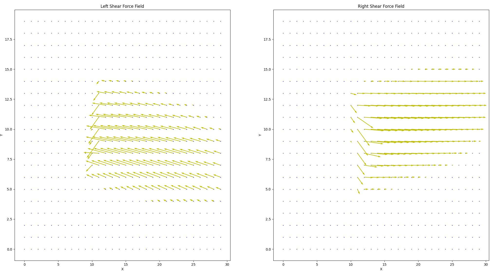
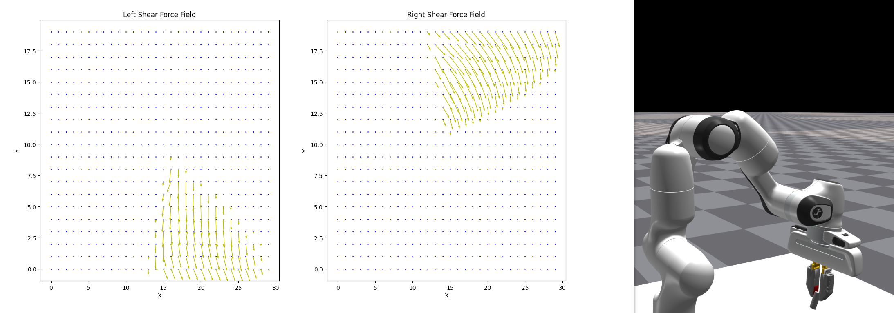
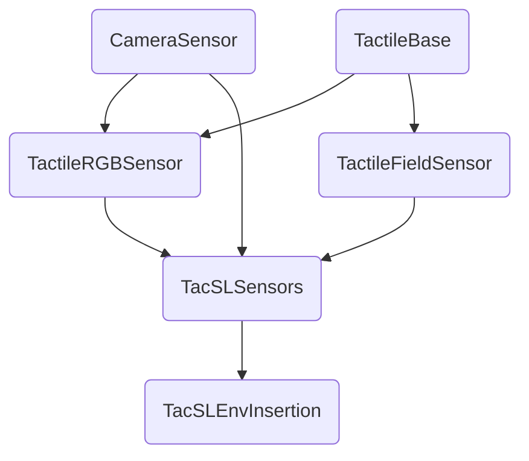
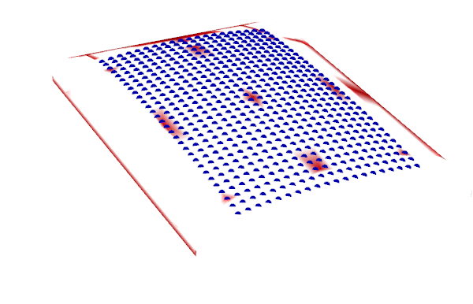
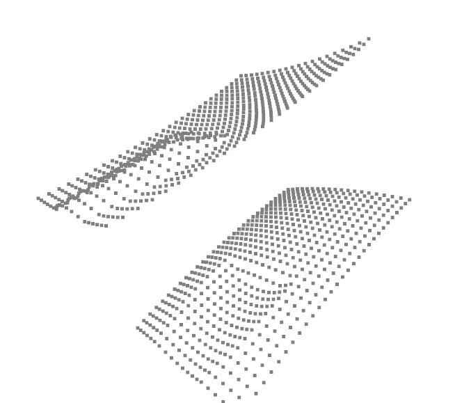
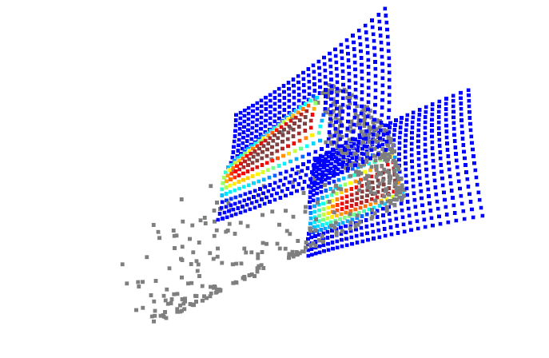
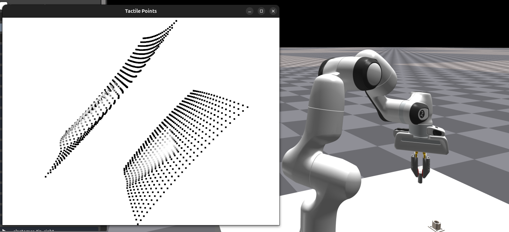
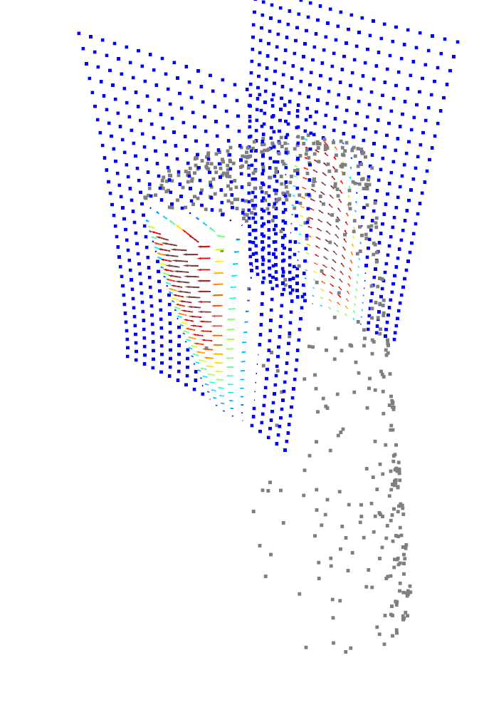
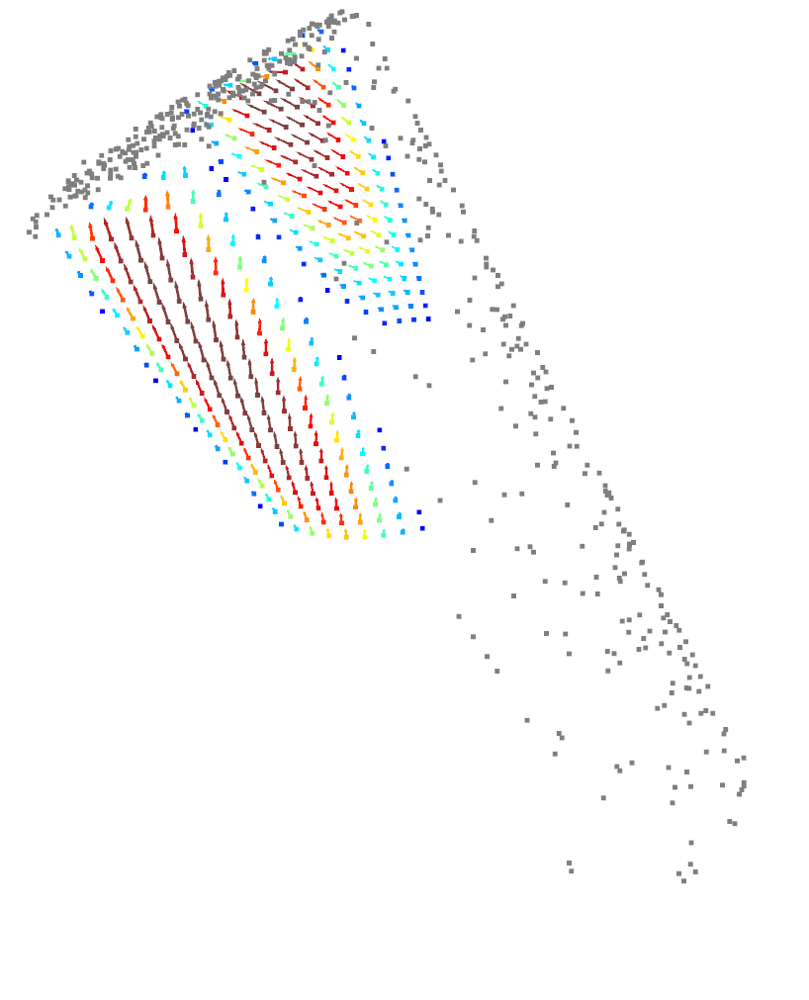

# 4. Understanding how Tacsl sensors work in IsaacGymEnv

These are specially created sensors that provide tactile information of the environment. We use this to understand how the robot interacts with the environment. 

## 4.1 Tacsl Sensor 

So we can get the raw tactile rgb data or the "force field" data from the Tacsl Sensors in IsaacGymEnv. The "force field" data is just the deformation field of the tactile sensors in the xy direction. This is normally done with optical flow on dotted patterns on the tactile sensors in real life. This is done naturally in IsaacGymEnv.

Here is an example of a shear field we get from visualizing `tactile_force_field_left` and `tactile_force_field_right` sensors in IsaacGymEnv when robot is holding an object.


The yellow arrow represents the direction of the deformation. We can also look at the tactile data along with the actual scene where the robot is interacting with the object.



As we can see, the red pads represent the tactile sensor on the robot. The robot is holding onto a peg at the very tip of the sensor. We can see that the sensors pads are inverted from each other and their relative direction for the right sensor is also inverted. 

<b> NOTE: </b> the `tactile_force_field_left` and `tactile_force_field_right` data structures are such that `tactile_force_field_left[..., 0]` is the normal direction (which is set to 0) and the same for the right sensor. 

## 4.2 Understanding Tacsl code

It's good to know where all of the code related to Tacsl is, so we present how the Tacsl class inheritance works in IsaacGymEnv. 



`TacSLEnvInsertion` is the environment class which we don't need much more detail about. We just need to know that `TacSLSensors` is the last abstraction we need to understand since it'll be accessed by the environment class.

We can see in `TactileFieldSensor` that it can run `generate_tactile_points` which if we visualize using Trimesh, we can see the points in 3d space.



This shows that we can definitely access the 3d tactile points in the environment 

### 4.3 Tracking shear field calculation

The force field data we visualized was first calculated in `tacsl_task_insertion.py` using `TacSLSensors.get_tactile_force_field_tensors_dict`. This function merely processes the raw data from `TactileFieldSensor.get_tactile_shear_force_fields`. The meat of this function is described here:

```python
def get_tactile_shear_force_fields(self):
    tactile_force_field = dict()
    for key, config in self.tactile_shear_field_configs_dict.items():
        indenter_link_id = config['indenter_link_rb_id']
        elastomer_link_id = config['elastomer_link_rb_id']
        ## AN NOTE: forces are here
        result = self.get_penalty_based_tactile_forces(indenter_link_id, elastomer_link_id)
        tactile_force_field[key] = result
    return tactile_force_field
```

so this relies on `TactileFieldSensor.get_penalty_based_tactile_forces`.



we got depth + shear and colored it like depth is visualized also added object too.









