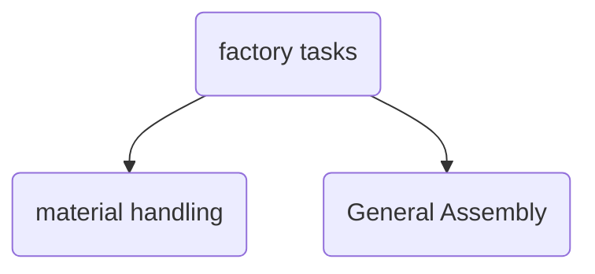

# Manipulation Keynote

## Tamim Asfour - Bimanual Taxonomy

He breaks down taxonomy as:
- noncoupled
    - left arm
    - right arm
- noncoupled
    - loosely coupled
    - tighlty coupled

Just a way to categorize manipulation.

He has also used object graphs to relate objects.

## Yasuhisa Hasegawa - Robot Mobility Support

## Alberto Rodriguez - Humanoids

Revelations:
- Factory work is really hard (whole-body tasks) and haptic driven.
- Many of these factory tasks aren't automated

material handling:
- sequencing
- kitting
- racking
- placing part in jigs

general assembly
- tight fit insertions
- connecting wires
- fastening bolts

Tough requirements:
- 99.x% reliability
- high precision (work dominated by haptic tasks)
- path to simple re-tasking
- path for early deployments in assembly lines

Journey:
- perception model -> VFM
- mission tasking -> LLM -> VLM + VLA
- manipulation skills -> BC or RL
- whole body control -> whole-body RL

example eAtlas doing RL pick and place using RGB:
- distill to RGB stereo
- works pretty well

whole-body control and mobility in RL
- robust sim-2-real
    - many specialist policies starting from human motion data
- scale sim training to build generalist body policy.

note on teleoperation:
- behaviors are inefficient.
- lacking dynamic content
- unnecessarily sequential

## Shuran Song - Making manipulation as simple as possible but not simpler

Learn from natural human demos So innovation is on teleop (noice).
- have to think like a robot to teleop.
- disconnects operator from contact (no haptic feedback)
- requires robot-in-the-loop

In the natural setting, we use our human hands to do a task, but that is not transferable to robots;
- this is the embodiment gap

UMI is becoming very universal (as the name entails).