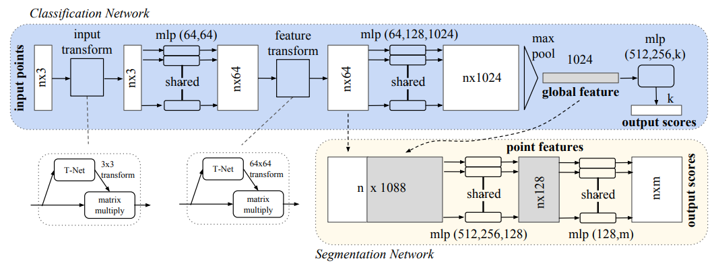

# PointNet
[paper link](https://arxiv.org/pdf/1612.00593)

**KEY**: Processing point clouds require us to be invariant to permutations of the input points. This is because on the computer, we must store the points in some order, but the order should not matter.

## Related Works

**Point Cloud Features**: Lots of works that have done some handcrafted learning for point clouds. Doing feature engineering with intrinsic/extrinsic features and local/global features. 

**Volumetric Data**: This transfers from our previous understanding of processing image data (2d CNNs), where we can do 3D CNNs. 
- This is constrained by resolution (voxel size). 
- Also compute cost (lots of memory to process empty space)

**Multi-view CNNs**: Lots of times we use multi-view data to get 3d point clouds. Instead of getting the 3d representation out of them, we just choose to process these images with 2D CNNs. It's non-trivial to extend this to stuff like **shape completion**.

**Meshes**: We can use Spectral CNNs to process meshes. However, this is constrained on manifold meshes like objects and not non-isometric shapes like furniture.

**Deep Learning on Unordered Sets**: People have done unordered set processing for NLP. However, this does not utilize the geometric information that comes from an unordered point set. PointNet should try to utilize this geometric information.

## Architecture

> this is the pointnet architecture.

The PointNet architecture aggregates information through max pooling all the point embeddings into one descriptor. 

Let our batched input be $$\mathbf{X} \in \mathbb{R}^{N \times D}$$ where $$B$$ is batch, $$N$$ is point set size, and $$D$$ is point dim.

Our points are first passed through a "T-Net" which is a spatial transformer network. 

This learns a transformation matrix and applies it the input points. T-Net creates a transformation matrix $$\mathbb{R}^{D \times D}$$ and is repeated $$N$$ times for each point in the point set (it isn't unique per point to preserve permutation invariance).

$$
\begin{align*}
\text{TNet} &: \mathbb{R}^{N \times D} \to \mathbb{R}^{N \times D \times D} \\
\mathbf{X}' &= \text{TNet}(\mathbf{X})\mathbf{X}
\end{align*}
$$

Ideally $$D=3$$ such that we learn a rotation matrix (something like that). Since this doesn't use projective geometry, do not think it will apply a translation.

We now apply MLP to $$\mathbf{X}'$ to get a point embedding.

$$
\begin{align*}
\mathbf{X}'' &= \text{MLP}(D,64)(\mathbf{X}') \\
\mathbf{X}''' &= \text{MLP}(64,64)(\mathbf{X}'') \\
\end{align*}
$$

Now we do a second transform but it's called a feature transform (64 dims). This will most likely do the translation reasoning in the PointNet.

$$
\begin{align*}
\mathbf{Y} &= \text{TNet2}(\mathbf{X}''')\mathbf{X}'''
\end{align*}
$$

The rest is just more MLP layers and finally a max pooling layer to get the global descriptor.

$$
\begin{align*}
\mathbf{Y}' &= \text{MLP}(64,512)(\mathbf{Y}) \\
\mathbf{Z} &= \text{MAXPOOL}(\mathbf{Y}') \\
\mathbf{Z} &\in \mathbb{R}^{512}
\end{align*}
$$

**Local/Global Info Aggregation**: When we do max-pooling, we get global point cloud features. However, segmentation needs local features also. Therefore, we use intermediate values after the feature transform like $$\mathbf{Y}$$ to get local features. 

**Why Input/Feature Transform?**: For processing points, it's not enough to use shared MLP implementation. We must use the input transform/feature transform idea to transform the points to a "canonical" form. 
- If we don't put the object into the object frame, we can instead learn this canonical alignment through the T-Nets. This is the point of the input transform. 
- The feature transforms help align different point clouds, so we do this alignment in feature space. Since the feature space transform is high-dimensional, it is hard to optimize, so we add a regularization term to constrain feature matrix to be close to orthogonal matrix 

$$
\begin{equation*}
\mathcal{L}_{\text{reg}} = \| \mathbf{I} - \mathbf{A}\mathbf{A}^T \|_F^2
\end{equation*}
$$
which is the frobenius norm (treat matrix as a vector and take the norm of that vector).

## Training Details

## Architecture Analysis