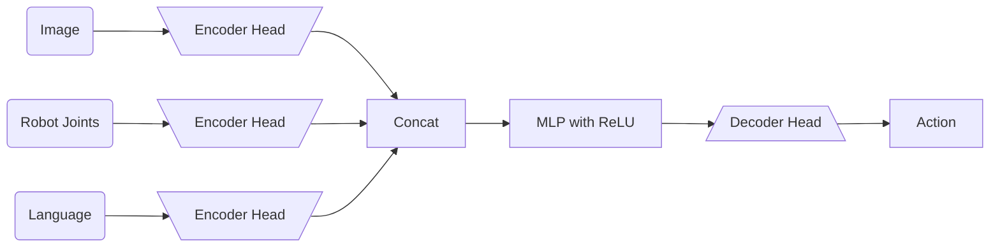

# Roadmap to Reinforcement Learning for Manipulation

## 1. Hard-code Approach

Something we want to break down first is the process of doing manipulation/control:
- Observation: What can the robot sense?
- Action: What can the robot do?
- Policy: How does the robot generate actions based on observations?

We need to have a starting point of how to do manipulation before moving to tactile sensors and tactile policies.

If we wanted to write up a policy for a task like pick-and-place, where we want to pick up a desired object and place it down in a specific location, we can break it down into the following steps:
- Identify object in the scene and get its pose.
- Generate/Execute a trajectory to pick up the object.
- Identify the target location and Generate/Execute a trajectory to place the object.
- Let go of object and return to home pose.

This seems very simple, and the observation is fairly simple as well. Using current state-of-the-art object detection algorithms + RGBD cameras, we can easily localize the object and use the manipulator to pick it up and place it down.

However, notice that we divided up the policy into phases. This means that as the user, we have to do a lot of engineering and design for a certain manipulation task.

**VERSATLITY**: Something that people in robotics are very interested in is versatility. Can I just minimally give specifications to the robot and it takes in observations and figures out exactly what actions to take?

**CAPABILITY**: Another thing to consider is whether a robot can perform a difficult task with some versatility. We can sacrifice the generality of the policy if it can perform a specific task well.

## 2. Control approach

Control theory has been a long-standing field that robotics has relied on for decades. The basis of control theory is to use the dynamics of the system to generate actions based on observations. As in, we encode the physics of the system into the policy and use that to generate actions.

In aerospace and automative, control theory has found a lot of success because of the ability to define a state space (position, velocity) and goal (desired position, desired velocity) and encode dynamics around that.

For example, let our system be defined such that the origin $$g = \begin{bmatrix} 0 \\ ... \\ 0 \end{bmatrix}$$ is the desired state. Then we define a general nonlinear system that takes in state $$x$$ and action $$u$$ such that:

$$\dot{x} = f(x, u)$$

where $$f$$ is the dynamics of the system. Our goal is to then stabilize the system around the origin. The traditional way to do this is to write out our policy by hand and plug in the equations into our robot code.

The current state-of-the-art approach and most widely used is to generate an optimization problem that finds actions that best minimize a cost function. This field is very deep and has a lot of theory behind it. One of the greatest benefits of control theory is getting guarantees from our systems and leveraging the deep insights from decades of research.

$$
\min_{u_{0:T-1}} \sum_{t=0}^T C(x_{0:T}, u_{0:T-1}) \\
\text{s.t.} \quad x_{t+1} = f_\Delta(x_t, u_t)
$$

While control is all great, there are a lot of limitations to applying it into the robotic manipulation setting.

**ISSUES IN MANIPULATION:**
- If we wanted to sweep a pile of dust, how would we concretely define the state space of the dust particles? Without proper definition of state space, we cannot apply control theory or even designate what a goal is.
- The dynamics of a system that does manipulation is very difficult to work with:
    - Mathematicians work on what they finds interesting problems (things you can solve for and are nice). 
    - Control theory stems from mathematical roots and thus uses lots of assumptions to make the math easier to work with.
    - The dynamics of a system with contact is very non-smooth in nature and cannot be easily solved using optimization (local methods) or through hand-written policies.
    - In fact, the optimization problem using the dynamics of this system is NP-hard.
        - NP problems are problems that are non-deterministic but can be verified in polynomial time.
        - As a reminder, NP-hard do not have to be NP. They just have to be as hard as an NP problem (NP-complete is reducible to said NP-hard problem).
    - One way of understanding this is that local actions around the state may or may not lead the state closer to a better solution. Non-local actions must be taken to get the optimal solution.
- Normally the system is a fixed element that we specify. This restricts the versatility of our policy if we vary object shape, object mass, and object material. 

**NOTE**: People try to accommodate for these issues by integrating deep learning in areas that are hard to work with. For example, we can learn latent sensor dynamics instead of the system dynamics itself or learn a model that is robust to object variation. However, it has been found that these approaches still have non-locality issues and have not found large adoption.

As a recap, here are issues with control theory:
1. Defining state space
2. Non-smooth dynamics (non-local nature of manipulation)
3. Rigidity of the system (fixed object shape, mass, material)

One way to forego the issues of state space is to do input-output control. Let $$y = g(x)$$ be the observation of the system. Then we can define a policy $$u = \pi(y)$$ that takes in the observation and generates actions. In other words, we use the observations directly to generate actions without needing to define a state space. This is easier said than done.

## 3. Learning approach (BC)

Robot learning has been a rising topic in the past decade and has solidified itself as a key area of research. Everyone has hopped on the ML train. This crowd of people are completely separate from the control theory crowd, so their work does not try to solve the issues of control theory. 

The BC approach takes in a dataset of observations and actions, $$D = \{(y_i, u_i)\}_{i=1}^N$$, and learns a policy $$\pi$$ that maps observations to actions. In this dataset, we also assume that the actions are optimal given the observations. This approach foregoes the need for state space or dynamics and instead focuses on learning a mapping from observations to actions.

Conceptually, we can see that given an observation (e.g. RGB image of the scene), we can output an action that is optimal for the task using a neural network. There are still some connections to control theory:
- We can actually view a well-trained BC policy as something that tries to stabilize the observations instead of the state space (like input-output control).
    - Observe that when BC policy sees the "goal" image, it outputs no actions. This is similar to stabilizing the system around the origin.
- The "goal" observation is implicitly encoded in the dataset instead of explicitly defined. Additionally, this "goal" is not a fixed element and can vary in the same dataset (goal can be noisy).

NOTE that the connection to control ends with Multi-task BC. Multi-task BC is when we have multiple tasks in the same dataset and the "goal" is specified as a language instruction.

Here's a diagram of a sample Multi-task policy BC neural network architecture:

Note that in here, the language instruction is used to "steer" the actions of a policy to perform a task from the dataset. This instruction is usually hard-coded into the dataset (No GPT robot unfortunately). TRI has shown  that without language instruction (all null tokens), the policy still does things with objects. This gives the intuition that language embeddings are not describing goals but rather steering the policy towards a certain action distribution related to the task. 

**RELATION TO MANIPULATION**: BC has gained a lot of traction in manipulation because a lot of tasks can just be performed by a human operator and easily replicated by the robot after training. The method is very versatile in terms of not having to really change the code for the policy. However, you do have to collect data for every task you want to perform. This is a big limitation of BC, as human data collection is very expensive and time-consuming.

**ISSUES/LIMITATIONS**: Current works are now trying to scale up BC and obtain a "GPT-moment" for robotics. However, there are still some limitations to BC:
1. Language is not precise and can be ambiguous. "Move the red block a little bit" can mean different things to different people.
2. Is it even possible to collect enough data for every task on every robot? This is highly debated, but the current consensus is that it is not possible to collect enough data for every task on every robot.
3. Can our models even scale with this approach? Will training a larger model equate to better performance?
4. Can BC do dexterous manipulation? Most tasks are simple pick-and-place tasks. The real question is whether BC can/should do things like in-hand manipulation, object balancing or pivoting, or cook a wok.

**NOTE on Dexterous Manipulation**: I honestly find that there's a very blurry line on what is dexterous manipulation and what is not. Is cooking a wok really dexterous manipulation? We're just moving a wok and spatula around. Many "dexterous manipulation" tasks are just pick-and-place or object grasping or moving objects around. It's honestly becoming a catch-all term for any manipulation task that isn't pick-and-place.

## 4. RL approach (Simulation)

Now reinforcement learning is not necessarily the next step up after BC, but it shows an interesting path forward. The jist of RL is the use of simulation to learn a policy. Can we get a robot to freely explore an environment and learn a policy that achieves a specified task? The big issue with RL is the sim2real gap. Can a robot learn a policy in simulation and transfer it to the real world?

If we can close this sim2real gap, then we can leverage the versatility and capabilities of simulation and use RL as a means of leveraging simulation to train strong manipulation policies. 

Using simulation, we can completely forego the need for human data collection or at least tremendously reduce it. 

**RL OVERVIEW**: The current state-of-the-art approach to robotics RL is to use PPO to train a neural network similar to the one used in BC in simulation. We can quickly summarize RL as follows:

$$
\begin{equation}
\max_{d} J(\theta + d) - J(\theta) \\
\text{s.t.} \quad \mathbb{E}_s \left[ D_{KL}(\pi_\theta(a \mid s) || \pi_{\theta + d}(a \mid s)) \right] \leq \epsilon
\end{equation}
$$

- $$J(\theta)$$ = $$\sum_{i=1}^N \sum_{t=1}^T \nabla_\theta \log \pi(a \mid s_t^t) A(s_t,a_t)$$
- $$A(s_t,a_t)$$ = $$Q(s_t,a_t) - V(s_t)$$

where we use an Actor-Critic method which contains an actor network and critic network (value function). The actor and critic can be assumed to have almost the same architecture until the very end where the actor outputs actions and the critic outputs a value. The actor generates actions on every rollout and is seen in this equation in $$a$$ and $$\pi$$ and the critic determines $$V(s_t)$$ which will also determine the Q-function $$Q(s_t,a_t)$$. We define the reward function based on the task we want to perform. 

If we just observed $$\nabla_\theta \log \pi(a \mid s_t^t) A(s_t,a_t)$$ and set the advantage function to 1, we can see that this is the gradient of the log-likelihood of the actions taken. In other words, our policy gradient method is already taking gradients to maximize the likelihood of actions taken. This is a common method used in generative modeling to match a distribution. Once we add in the advantage function, we are now weighing which action distributions are better than others. In order for RL to train a good policy, we have to be able to use rewards to guide the policy towards actions that we know will help achieve the task. Without a good reward function, we could likelihood update our network towards a bad action distribution and possibly stay in that bad action distribution without hope of recovering.

**STATE SPACE?**: Based on this already, we can see that RL has a similar problem to control theory. How do you go about defining a reward function if there is no clear notion of state? 
- Actually, you can normally simulate piles of objects and liquids in simulation, so you can define a reward function saying if a pile is in a reasonable configuration.
- However, this assumes that you can actually simulate at all.
- Based on this, simulation already requires you to define some sort of state for these weird objects, so we use that to define a reward function.