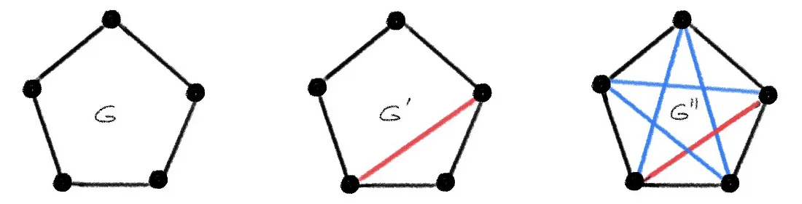

# Beyond Weisfeiler-Lehman (approximate isomorphisms and metric embeddings)

## Higher-order WL test

One approach to extend the isomorphism test is to try k-WL tests and create GNNs that are based on these tests. [https://arxiv.org/pdf/1905.1113]()

From this paper, it takes a lot more computational cost and uses non-local operations.

---

## Approximate isomorphism motivation

GNN can be seen as attempting to find a graph embedding $$f(\mathcal{G})$$ with the desired property:
$$
\begin{align}
f(\mathcal{G}) = f(\mathcal{G'}) 
\end{align}
$$

For the WL-1 test, if $$\mathcal{G} \simeq \mathcal{G}'$$, then $$f(\mathcal{G}) = f(\mathcal{G}')$$

This is necessary but not sufficient, so the statement:
$$f(\mathcal{G}) = f(\mathcal{G}')$$ implies $$ \mathcal{G} \simeq \mathcal{G}' $$
is not necessarily true.
In other words, 2 non-isomorphic graphs can result in equal embeddings.

Practically speaking, it is better to deal with approximate isomorphisms. Since this is no longer a boolean (yes/no) thing, we must define this through a metric $$d$$. Below is an example of 3 graphs $$\mathcal{G}, \mathcal{G}', \mathcal{G}''$$. We want to say that $$\mathcal{G}$$ is approximately isomorphic to $$\mathcal{G}'$$. We also want to say that $$\mathcal{G}'$$ and $$\mathcal{G}''$$ are not that isomorphic. The distance in this case should be much higher.

---

## Graph Edit Distance

The graph edit distance (GED) is a measure of similarity between 2 graphs. 

The GED between two graphs $$\mathcal{G}_1, \mathcal{G}_2$$ is defined as:
$$
\begin{equation}
\mathcal{D}(\mathcal{G}_1, \mathcal{G}_2) = \displaystyle \min_{(e_1,...,e_k) \in \mathcal{P}(\mathcal{G}_1, \mathcal{G}_2)} \sum_{i=1}^k c(e_i)
\end{equation}
$$

In this case, $$\mathcal{P}(\mathcal{G}_1, \mathcal{G}_2)$$ is the set of edit paths transforming $$\mathcal{G}_1$$ to $$\mathcal{G}_2$$. $$c(e) \geq 0$$ is the cost function of a certain edit operation $$e$$.

This is the unique set of edit operators:
- vertex insertion
- vertex deletion
- vertex substitution
- edge insertion
- edge deletion
- edge substitution

An edit path is an ordered list of these edit operators to go from $$\mathcal{G}_1$$ to $$\mathcal{G}_2$$.

We have seen many things like this in our data structures class (word edit distance). However, this is very discrete in nature and running the GED may take a long time and also be very hard to analyse. However, this is a proper measure of similarity between graphs. Just wanted to throw in an example that I'm most familiar with.

Check out this page for another example of graph distance [this page](../assets/pdfs/gromov_hausdorff_distance.pdf).

---

## Graph metric through isometry embedding

An important property of a metric is $$\mathcal{D}(\mathcal{G},\mathcal{G}') = 0$$ iff $$\mathcal{G} \simeq \mathcal{G}'$$ which implies that isomorphic graphs have indiscernable embeddings. We consider an embedding to be an output of a function $$f$$.

We define an isometry embedding as

$$
\begin{equation}\label{isometry-eq}
\mathcal{D}(\mathcal{G},\mathcal{G}') = \| f(\mathcal{G}) - f(\mathcal{G})' \|
\end{equation}
$$

which replaces the previous graph distance stuff with Euclidian distance.

The thing is that designing this function $$f$$ for every instance of graphs is way too tough. It's possible that similar graphs are less similar in embedding space.

---

## Approximate Isometry Embedding

Maybe the previous formulation is way too strict. If we relax Eq. ($$\ref{isometry-eq}$$), then maybe we can get better properties. One such approach people found was metric dilation.

$$
\begin{equation}\label{metric-dil}
c^{-1} \mathcal{D}(\mathcal{G},\mathcal{G}') \leq 
\| f(\mathcal{G}) - f(\mathcal{G}') \| \leq c \mathcal{D}(\mathcal{G}, \mathcal{G}'), c \geq 1
\end{equation}
$$

It kind of looks like two lipschitz conditions or a bi-lipschitz condition. This kind of embedding that follows this property is called an approximate isometry.

This actually only addresses the problem where similar graphs are less similar in embedding space. However, you'll notice when $$\mathcal{G} \simeq \mathcal{G}'$$, $$\mathcal{D}(\mathcal{G}, \mathcal{G}') = 0 $$ which reduces Eq. ($$\ref{metric-dil}$$) into: $$ \|f(\mathcal{G}) - f(\mathcal{G}')\| = 0 $$.

This is still a very strict condition and finding a function $$f$$ that can achieve this would be too tough.

Another trick people employ is to further relax this condition with metric distortion $$\epsilon$$:

$$
\begin{equation}
c^{-1} \mathcal{D}(\mathcal{G},\mathcal{G}') - \epsilon \leq 
\| f(\mathcal{G}) - f(\mathcal{G}') \| \leq c \mathcal{D}(\mathcal{G}, \mathcal{G}') + \epsilon, c \geq 1
\end{equation}
$$

this sets a tolerance for how far apart graphs can be to be considered approximately isomorphic.

---

## Probably Approximate Isometry

We can also add some probability on this boi. This is part of Probably Approximately Correct theory (PAC). 

$$
\begin{equation}
P(c^{-1} \mathcal{D}(\mathcal{G},\mathcal{G}') \leq 
\| f(\mathcal{G}) - f(\mathcal{G}') \| \leq c \mathcal{D}(\mathcal{G}, \mathcal{G}')) > 1 - \delta
\end{equation}
$$

In this case, there is only metric dilation (approximate). Then metric distortion logic is all calculated under the probability inequality. The "probably" statement is obviously from the "P()" and will eventually yield better analysis.

---

## Limitations

This doesn't cover that fact that each node has a feature, and we can also calculate graph similarity through this information.

We also have not designed GNNs using these newly introduced isometry embeddings.

TODO: look at how to design GNNs based on this.