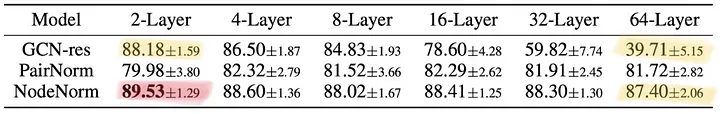

# Scaling GNNs

## Depth on graphs

Problems specific to graphs
- over-smoothing: node features converge to the same vector
- over-squashing: when message-passing fails to propagate information efficiently (bottle-necked) on a graph.

Regularization techniques to address these depth problems
- DropEdge (edge-wise dropout)
- PairNorm (pairwise distance normalization on node features)
- NodeNorm (node-wise mean and variance normalization)

Architectural techniques
- Residual connections (jumping knowledge or affine residual connection)
- NOTE: while these residual techniques allow us to train on deeper layers, there is not much significant improvements.

From the table above, the left column is the technique used on top of a GCN. The individual elements of the table represents the mean accuracy of node classification on a CoAuthor Citation Network. The "+/-" is the standard deviation.

We can also see that the best performance stems from using NodeNorm on a 2-layer GCN. This goes against the intuition that deeper is better even if you could train deeper networks.

This goes against the intuition on grid-structured data (images) where deeper architectures have brought breakthroughs in performance. This paper shows that deeper graphs on structured data such as molecules and point clouds [https://arxiv.org/pdf/1904.03751]() can be beneficial. How come it's different from graph datasets like Cora, Pubmed, or CoauthorsCS (citation datasets)?

Differences are that the molecule and point cloud graphs are relatively small in graph diameter. That means that going from one node to another takes only a few hops.

Another thing to consider is whether a problem will require a short-range or long-range hop information. Some molecular datasets are still tough because they require long-range information (nodes that are far apart need to pass information to each other). Deep GNNs are needed for these datasets too.

Instead of running deep networks with shallow filters (low message-passing, more layers stacked), we can do the opposite (high message-passing, shallow layers stacked). This was tested in the SIGN paper (Scalable Inception-like Graph Networks) [https://arxiv.org/pdf/2004.11198]().

--- 

## GCN overview

This is a simple GNN architecture that can work on very large graphs (demonstrated on Twitch follow graph dataset). A GCN message-passing operation on a graph $$\mathcal{G} = (\mathcal{V}, \mathcal{E}) $$ can be written as below:

$$
\begin{equation}
\mathbf{Y} = \text{ReLU}(\mathbf{A}\mathbf{X}\mathbf{W})
\end{equation}
$$

Here, $$ \mathbf{W} \in \mathbb{R}^{n_f \times \lvert \mathcal{V} \rvert}$$ is a learnable weight matrix where $$n_f$$ is the feature dimension and $$\lvert \mathcal{V} \rvert$$ is the number of nodes. $$\mathbf{X} \in \mathbb{R}^{\lvert \mathcal{V} \rvert \times n_f}$$ is the data matrix. $$\mathbf{A} \in \mathbb{R}^{n_y \times \lvert \mathcal{V} \rvert}$$ is a message-passing matrix (normally just adjacency where each row corresponds to a message to pass to 1 node). This matrix can also be weighted (like in GAT). 

Node-wise classification for a 2-layer GCN would look like this:

$$
\begin{equation}
\mathbf{Y} = \text{softmax}(\mathbf{A}_2 \text{ReLU}(\mathbf{A}\mathbf{X}\mathbf{W}_1)\mathbf{W}_2)
\end{equation}
$$

---

## Batch issue with training

Nowadays, we do process mini-batches on our datasets. This actually assumes that each datapoint is sampled iid from the data distribution. In our case, the nodes have dependencies to each other. This makes running batched operations very difficult. This is because batching is fundamentally sampling from the dataset of nodes and since these nodes depend on each other, it could make some nodes appear more often in the batching phase.

Early GNN works like GCN, [ChebNet](https://arxiv.org/abs/1606.09375), [MoNet](https://arxiv.org/abs/1909.11793), and [GAT](https://arxiv.org/abs/1710.10903) were trained using full-batch gradient descent. In other words,This meant that time complexity of an L-layer GCN would be $$\mathcal{O}(L\lvert \mathcal{V} \rvert n_f^2)$$ and memory complexity $$\mathcal{O}(L\lvert \mathcal{V} \rvert n_f + Ln_f^2)$$.

---

## GraphSAGE

[GraphSAGE](https://arxiv.org/abs/1706.02216) was the first work to tackle this issue (Bronstein considers this a seminal paper).
The SAGE acronym stands for "sample and aggregate". It essentially does neighborhood sampling and mini-batching to train GNNs on large graphs. The takeaway is that to compute the training loss of a single node with an L-layer GCN, only the L-hop neighbors of that node are necessary. 

This doesn't address "small-world" graph networks which are low-diameter but high connectivity. The high-connectivity can make 2-hop neighborhoods already contain way too many nodes (in the millions for social networks). GraphSAGE tackles this by sampling neighbors up to L-th hop: starting from training node, it samples uniformly (with replacement) a fixed number k of 1-hop neighbors, L times. For every node, we are guarantteed to have a bounded L-hop sampled neighborhood of $$\mathcal{O}(k^L)$$ nodes. If we then construct a batch with b training nodes, each with its own independent L-hop neighborhood, we get memory complexity of $$\mathcal{O}(bk^L)$$ Now the memory complexity of one batch compute is $$\mathcal{O}(bLn_f^2k^L)$$.

The thing with GraphSAGE is that it could introduce a lot of redundant computation since sampled nodes can appear a lot of times in a dataset.

NOTE: this is specifically useful for node-wise classification or regression as everything is done per node (thus the training loss can be distributed between nodes and now you're sampling between nodes). If you aggregate the node features like PointNet, then there is no benefit to this.

Lots of follow-up works like [ClusterGCN](https://arxiv.org/abs/1905.07953) and [GraphSAINT](https://arxiv.org/abs/1907.04931)

---

## SIGN

Empirical Findings:
- Simple fixed aggregators (like GCN) outperform GAT and MPNN.
- It is an open question whether depth in GNNs are needed.

The key in this work is to run the linear diffusion operator in parallel:

$$
\begin{align*}
\mathbf{Z}_0 &= \mathbf{X}\mathbf{W_0} \\
\mathbf{Z}_1 &= \mathbf{A_1}\mathbf{X}\mathbf{W_1} \\
\mathbf{Z}_2 &= \mathbf{A_2}\mathbf{X}\mathbf{W_2} \\
&... \\
\mathbf{Z}_r &= \mathbf{A_r}\mathbf{X}\mathbf{W_r} \\
\mathbf{Z}   &= \begin{bmatrix} 
\mathbf{Z}_0 & \mathbf{Z}_1^T & \mathbf{Z}_2^T & ... & \mathbf{Z}_r^T 
\end{bmatrix}^T \\
\mathbf{Y} &= \text{softmax}(\text{ReLU}(\mathbf{Z}) \mathbf{W}')
\end{align*}
$$

The $$\mathcal{Z}_i$$ are pre-computed which shows that $$\mathcal{A}_i\mathcal{X}$$ are pre-computed (everything but the learnable parameter).

This method can be trained using the simple mini-batch gradient descent method.