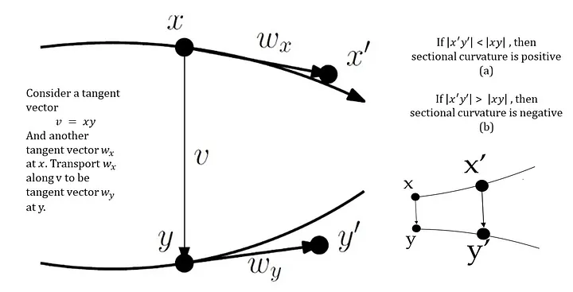
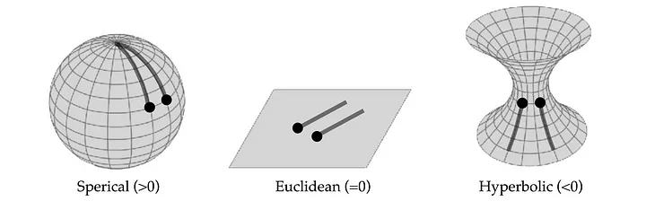
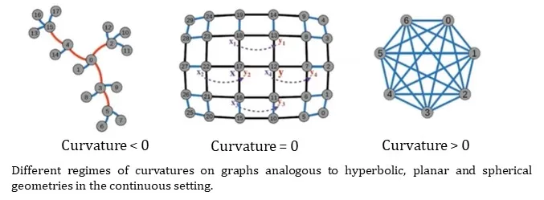

# Graph Rewiring
---

## Over-squashing

Over-squashing is defined as:
> Distortion of information flowing from distant nodes as a factor 
> limiting the efficiency of messsage passing for tasks relying on long-distance
> interactions.

Lets consider the $$(\ell+1)$$-th layer of an MPNN:

$$
\begin{equation}
\mathbf{h}_i^{(\ell+1)} = \phi_\ell (h_i^{(\ell)}, \sum_{j=1}^n \mathbf{\hat A}_{ij} \psi_\ell (\mathbf{h}_i^{(\ell)}, \mathbf{h}_j^{(\ell)}))
\end{equation}
$$

where $$\psi$$ is a message function, $$\mathbf{\hat A}$$ is the adjacency matrix, and $$\phi$$ is a node update function. Additionally, $$\psi$$ is lipschitz-bounded by $$\alpha$$ and $$\phi$$ is lipschitz-bounded by $$\beta$$ at layer $$\ell$$. Lets use a simple lipschitz condition:

$$
\begin{align}
\| \nabla \phi \| \leq \alpha \\
\| \nabla \psi \| \leq \beta 
\end{align}
$$

Consider a node $$s$$ that minimally takes $$r$$-hops to reach node $$i$$. This can be expressed in $$d_G(i,s) = r+1$$. Over-squashing is understood as node $$i$$'s representation failing to be affected by the input feature of node $$s$$. In other words, we should observe the jacobian.

$$
\begin{equation}
\frac{\partial \mathbf{h}_i^{(r+1)}}{\partial \mathbf{x}_s} \leq (\alpha \beta)^{(r+1)} (\mathbf{\hat A}^{(r+1)})_{is}
\end{equation}
$$

Since $$\alpha$$ and $$\beta$$ are constants, it is actually $$\mathbf{\hat A}$$ or the structure of the graph that affects the over-squashing or jacobian. NOTE: $$\mathbf{\hat A}^{(r+1)}$$ means that we passed messages $$r$$ times or did $$r$$ hops. Structural properties of a graph that lead too over-squashing are called bottlenecks.

The overall thing we want to do to tackle over-squashing is to use Ricci curvature to identify bottlenecks and then rewire the graph to remove them.

--- 

## Ricci Flows and Curvature (shitty overview)

### Sectional Curvature

Sectional curvature helps understand curvature of Riemmanian manifold. When we average sectional curvature over all directions, we get the Ricci curvature (average of sectional curvature over all facets). Ricci curvature can be thought of as a curvature that quantitatively measures how space is curved. 

### Graphs and Ricci Curvature

Most of the details are in this [paper](https://arxiv.org/pdf/2111.14522).

This paper uses Balanced Forman Curvature to calculate the Ricci curvature of a graph. Using this idea, we can rewire graphs.

## Paper