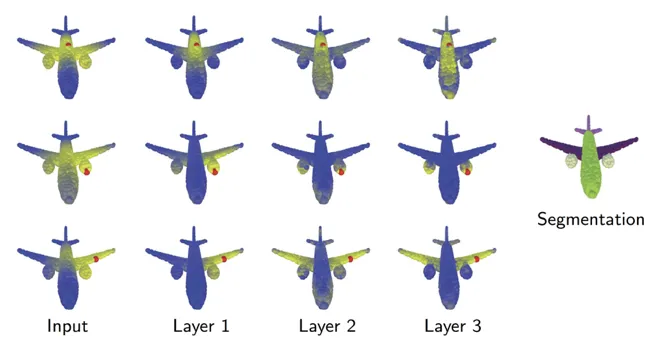
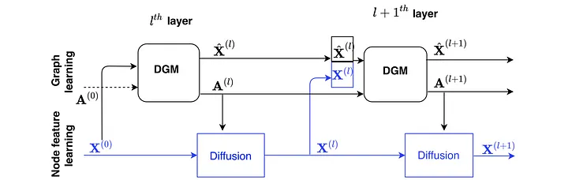
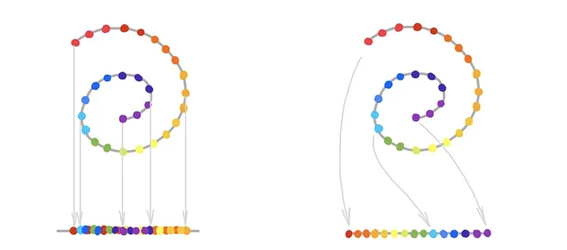
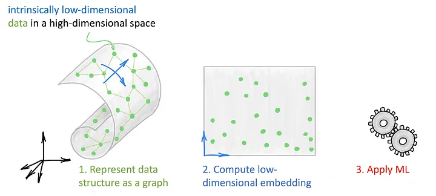

# Latent GNNs (Manifold Learning?)

## Relation with PointNet

Bronstein and Yue Wang both worked on using graphs as coarse representations of the object manifold instead of dense point clouds. With PointNet, you apply some shared learnable point-wise function to each point. Additionally, they applied message-passing on a graph. More can be explored in [Dynamic Graph CNN (DGCNN)](https://arxiv.org/pdf/1801.07829). A key observation of Yue was that the graph structure didn't have to be static throughout, and it could/should be updated dynamically.

Example of DGCNN being used for point cloud segmentation in place of PointNet. The graph is updated dynamically, and the graph features are used to compute the final point-wise features.

Limitations:
- This approach generated graph and graph features on the same latent embedding space.

A followup work called [Dynamic Graph Module](https://arxiv.org/pdf/2002.04999) (DGM) decouples graph and feature construction. This work has impressive results in medical domain like disease prediction on brain imaging data and other patient data features. DGM also beat DGCNN on point cloud classification/segmentation tasks.

---

## DGCNN

---

## DGM

---

## Connection to manifold learning

These two models bear similarity to manifold learning or non-linear dimensionality reduction algorithms. The underlying assumption is that the data lies on a low-dimensional manifold embedded in a high-dimensional space. The purpose of manifold learning is to capture these low-dim structures by reconstructing the manifold. This is unlike PCA which is a linear dimensionality reduction algorithm.

Left uses linear projection which leaves clumps of data on the line. Right uses non-linear projection which captures the manifold structure of the data and the data is more evenly distributed on the line.

---

## Manifold Learning
Manifold learning vary in how they recover a "manifold", but they share a blueprint.
1. Create representation of the data, typically done with a k-nearest neighbor graph.
2. (where methods differ) Compute low-dim representation (embedding) of data trying preserve structure of original data. [Isomap](../assets/pdfs/isomap.pdf) tries to preserve graph geodesic distance, [Locally Linear Embedding](../assets/pdfs/locally-linear-embedding.pdf) (LLE) finds local representation of adjacent points, and [Laplacian eigenmaps](../assets/pdfs/laplacian-eigenmaps.pdf) uses eigenfunctions of the graph Laplacian operator as low-dim embedding.
3. Once representation is computed, an ML algorithm (clustering) is applied to it.

--- 

## Isomap

---

## Locally Linear Embedding (LLE)

---

## Laplacian Eigenmaps

---

## Graph Deep Learning Perspective on Manifold Learning

Graph Deep Learning combines the 3-steps into a single-step process which is the GNN. It's a much more modern take and is end2end. The GNN is trained to learn the representation of the data and the graph structure simultaneously.

---

## Applications of Latent Graph Learning

List of applications:
- Few-shot learning (graphs can help generalize from a few examples).
- Biology (molecules, proteins, ... any interaction between two entities)
- Analysis of physical systems (multi-object interactions, ...).