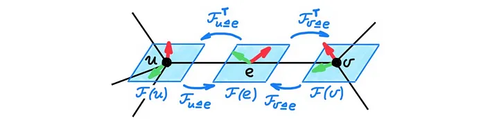
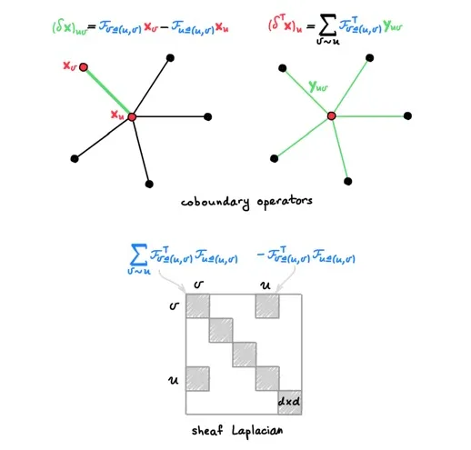

# Neural Sheaf Diffusion for Graphs
This is based on [Neural Sheaf Diffusion for Graphs](https://arxiv.org/pdf/2202.04579).

## Fresh perspective on GNN issues

GNNs have long suffered from performance on heterophilic graphs and oversmoothing.

In the Neural Sheaf Diffusion paper, they argue that the root of both of these problems lies in the "geometry" of the graph. Graphs and manifolds are topological objects (have a notion of neighborhood) but not distance or direction. We can define some notion of geometry by decorating each node and edge with a vector space structure (these are called stalks) and a collection of linear transforms (restriction maps) between stalks of every node and edge.

In this image $$\mathcal{F}(u)$$, $$\mathcal{F}(v)$$, and $$\mathcal{F}(e=(u,v))$$ are stalks. The others are restriction maps to go back and forth between the stalks. The graph with stalks and restriction maps is called a cellular sheaf. Sheaves are main objects of study in algebraic topology and are roughly thought of as a general way to describe data defined on a topological space.

---

## Sheaves

Sheaves are closely related to that of a connection in differential geometry. A connection "connects" tangent spaces of two nearby points on a smooth manifold. This connection is needed to perform parallel transport of vectors along a curve. The connection is defined by a linear map between the tangent spaces of two points. Defining the connection endows a manifold with geometric strucutre, different connections give rise to different geometric structures.

---

## Sheaf and Graph Diffusion

Sheaf diffusion equation described below:
$$
\begin{equation}
\mathbf{\dot  x}(t) = - \Delta \mathbf{x}(t)
\end{equation}
$$

Sheaf Laplacian $$\Delta$$ is an $$nd \times nd$$ matrix, where $$nd$$ is dimension of vector $$x$$. It acts on d-dimensional stalk. 

As we run diffusion with the sheaf laplacian, as the limit $$t \to \infty$$, the diffusion converges to a solution which belongs to harmonic space of sheaf laplacian. Any node classification task can be posed as finding the right sheaf on which the limit of sheaf diffusion is able to linearly separate node features. This can be seen as an alternative test to the well known WL-test. 

Choosing $$d=1$$ and non-zero restriction maps (non-negative weights) corresponds to standard diffusion on a graph (GCN). These architectures can only separate 2 classes of nodes under homophily assumptions. With asymmetric restriction maps, we can have negative weights which was shown to work in heterophilic graphs.

--- 

## Sheaf Convolutional Networks and Energy Minimisation

We try to connect sheaf theory to deep learning on graphs. Consider the following GNN layer:

$$
\begin{equation}
\mathbf{Y} = \sigma((\mathbf{I} - \Delta)(\mathbf{I} \otimes \mathbf{W}_1) \mathbf{X} \mathbf{W}_2)
\end{equation}
$$

where $$\mathbf{X} \in \mathbb{R}^{nd \times f}$$ is input features with f channels, $$\mathbf{W}_1, \mathbf{W}_2 \in \mathbb{R}^{f \times f}$$ are learnable weights. $$\Delta \in \mathbb{R}^{nd \times nd}$$ is sheaf laplacian. $$\otimes$$ is the Kronecker product. $$\sigma$$ is a non-linear activation function (ReLU or LeakyReLU). This is called a Sheaf Convolutional Network (SCN).

We examine the sheaf dirichlet energy $$\mathcal{E}(\mathbf{X}) = \text{trace}(\mathbf{X}^T \Delta \mathbf{X})$$. This is a quadratic form analogous to classical Dirichlet energy that measures distance of $$\mathbf{X}$$ from harmonic space of sheaf Laplacian. Diffusion equations are gradient flows of the Dirichlet energy, minimising it over time. Application of one GCN layer necessarily decreases the energy $$\mathcal{E}(\mathbf{Y}) \leq \mathcal{E}(\mathbf{X})$$. As a result, features tend to become smoother with increased depth. 

However, in the sheaf diffusion case, if we choose a sheaf, it is possible to increase the energy.