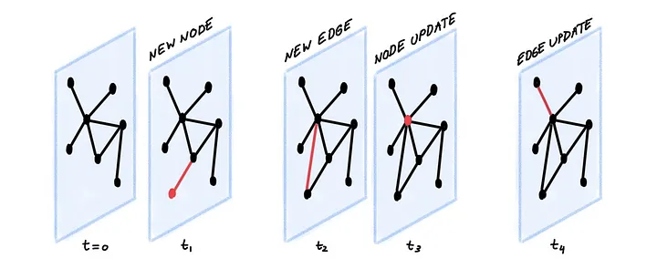
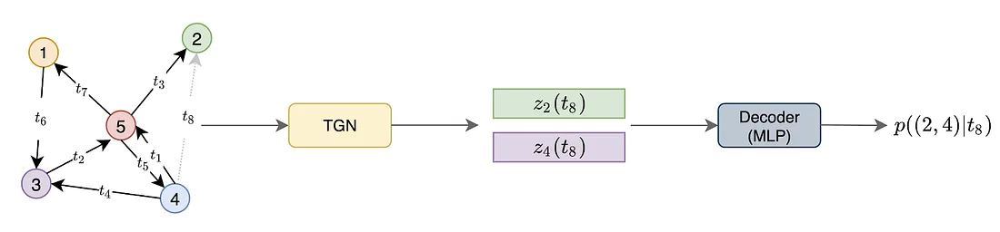
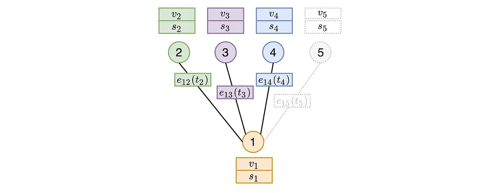
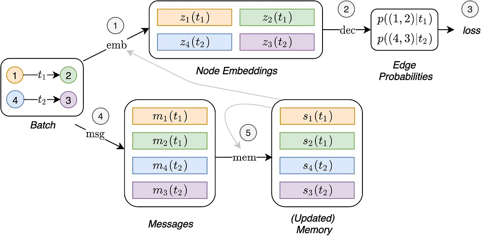
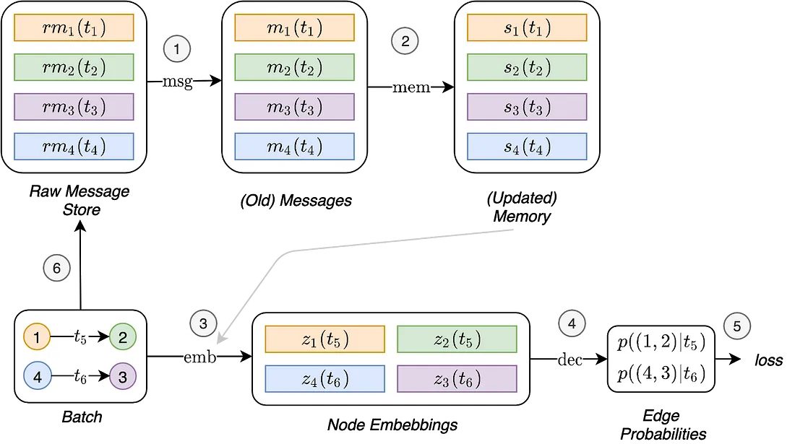

# Temporal GNNs

## Motivation

At the time (era of GCN, GAT, MPNN, GraphSAGE, ...etc), GNNs have mostly been ran on static graphs. As in, these graphs do not change over time. However, lots of interesting data is dynamic, so we want to extend our algorithms to work on dynamic graphs. These kinds of graphs change over time (not just features, sometimes nodes/edges are added/deleted).

Above image shows a time-series dynamic graph.

## Temporal Graph Networks (TGN)

This was developed at twitter to take in a graph interaction network over a time-series and predict interaction network in the future step.

TGN encoder overview. The goal of this diagram is to predict the future interaction between nodes 2 and 4. TGN computes embeddings for nodes 2 and 4 and then concatenates them and feeds it to MLP decoder.

Components of a TGN:
- Memory
- Message Function
- Memory Updater
- Embedding

## Memory

This is analogous to the RNN hidden state. If a new node is added, we add a state of vectors to our data matrix.

## Message Function

Main mechanism for updating memory. Given interaction between nodes i and j at time t, message function computes two messages (one for i and one for j), which are used to update memory. Analogous to messages in MPNN. The message is a function fo the memory of nodes i and j at time $$t^-$$ preceding interaction, the interaction time t, and the edge features.

$$
\begin{align}
\mathbf{m}_i(t) = \text{msg}(\mathbf{s}_i(t^-), \mathbf{s}_j(t^-), t, \mathbf{e}_{ij}(t)) \\
\mathbf{m}_j(t) = \text{msg}(\mathbf{s}_j(t^-), \mathbf{s}_i(t^-), t, \mathbf{e}_{ij}(t))
\end{align}
$$

## Memory Updater
The memory updater updates memory with new messages. This is implemented as an RNN.

$$
\begin{align}
\mathbf{s}_i(t) = \text{mem}(\mathbf{m}_i(t), \mathbf{s}_i(t^-))
\end{align}
$$

Given that this memory is a vector, we could try to use this as our node embedding. In practice, this can be stale as we have to wait until the next interaction to update the memory.

## Embedding
A solution is to look at node neighbors. The embedding module computes temporal embedding of a node by performing graph aggregation over the spatiotemporal neighbors of that node. Even if a node has been inactive for a while, it likely has some neighbors that were active. 

## Overall Compute Architecture

