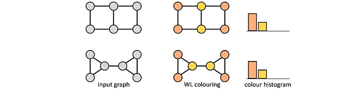
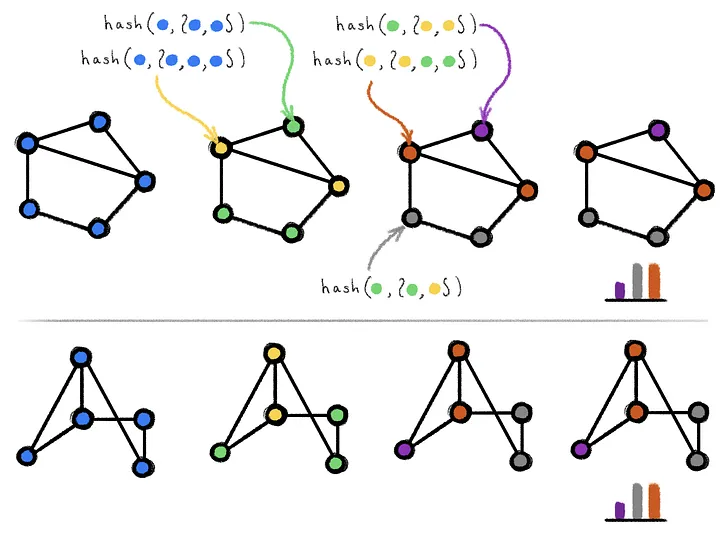

# Weisfeiler-Lehman Test
The Weisfeiler-Lehman Test (WL-test) is a test that you can conduct to see if two graphs are isomorphic.

---

## Isomorphism Quick Description
First lets define what isomorphism is. Generally, an isomorphism is a mapping between two spaces such that the structure between the 2 spaces are preserved. This is kind of vague, but I have seen examples of these before.

Examples of Isomorphisms:
- Homeomorphism (isomorphism of topological spaces)
- Diffeomorphism (isomorphism of spaces with differentiable structure)
- Symplectomorphism (isomorphism of symplectic manifolds, preserves energy)

One super specific example that I know of:
$$\mathrm{SO(3)} / \mathrm{SO(2)} \cong \mathrm{S}^2$$
In other words, the quotient space between $$SO(3)$$ and $$SO(2)$$ is isomorphic to $$S^2$$.

---

## Graph Isomorphism

Let $$\mathcal{G}_1 = (\mathcal{V}_1, \mathcal{E}_1) $$ be the first graph and $$\mathcal{G}_2 = (\mathcal{V}_2, \mathcal{E}_2) $$ be the second graph.

An isomorphism between these graphs,  $$\mathcal{G}_1 \simeq \mathcal{G}_2$$ is when there exists a mapping $$f$$ that is isomorphic meaning:

$$
\begin{equation}\label{graph-isomorphic}
f: V_1 \to V_2
\end{equation}
$$

where $$f$$ is bijective. Additionally, $$f$$ does not affect the edge set between the graphs thus preserving the connectivity between the graphs.

Then we can interpret isomorphism as two graphs that have the same connectivity.
Diving deeper into the notes, you can take a look at [this page](../assets/pdfs/graph_isomorphism.pdf)

---

In terms of Graph Neural Networks (GNNs), graph isomorphisms are important because running the GNN layer over isomorphic graphs will return the same results.

GNNs will actually still provide similar outputs even if the graphs are not isomorphic. It has been found that GNNs are at most as expressive as the WL-1 test.

This is an example of a pair of graphs that are not isomorphic but fail the WL-1 test. This means the GNN output will be the same.

---

## How WL-1 test works

It's a very simple algorithm.
1. $$\lambda_0$$ is the initial color. Assign this color to each vertex $$\lambda_0(v)$$ where $$\lambda_0$$ is the label of vertex $$v$$. Just make sure you know that there is a difference between a color and a label (for us it'll be a 2-tuple).
2. $$ \forall v \in \mathcal{V}, \lambda_{i+1} = (\lambda_i(v) | \{\{\lambda_i(w) | w \in \mathcal{N}(v)\}\}) $$ 
3. repeat step-2 over and over again until color distribution converges (stays the same).
4. run on both graphs. if the histogram is the same, then 1-WL test considers these graphs "isomorphic" meaning GNN will give same result.

This is a figure showcasing the WL-1 test / color algorithm

There does exist higher-order WL-tests and you can design GNNs to support these, but it might not be as important. Apparently, the WL-1 test works for most graphs.