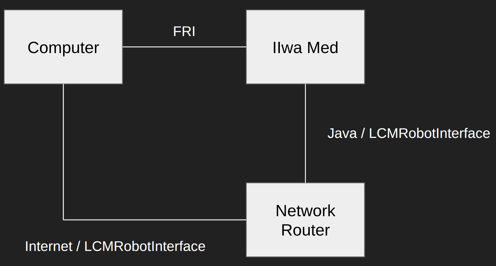
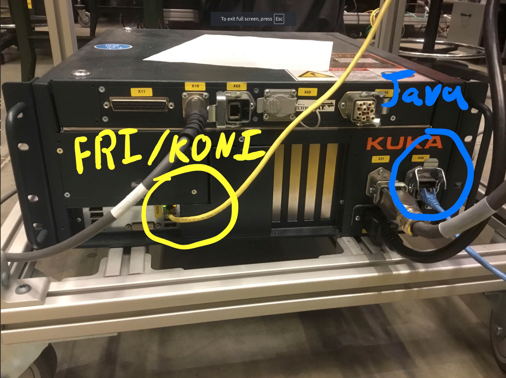
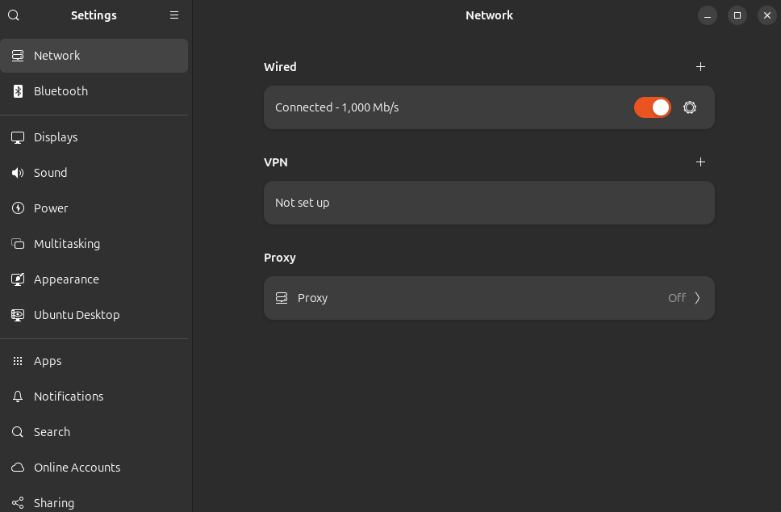
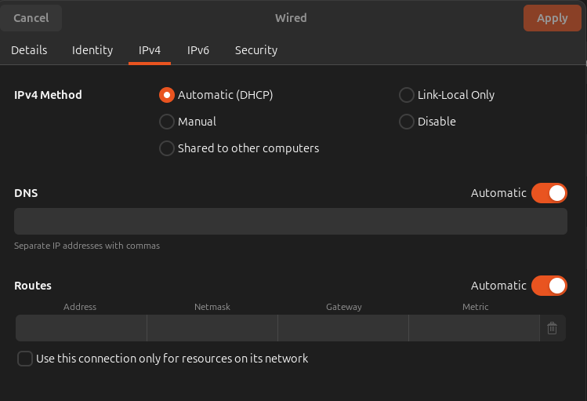
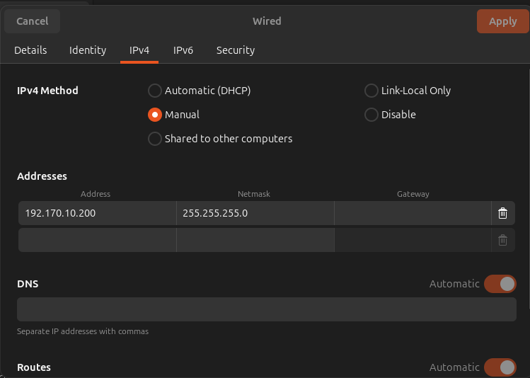

---
# Feel free to add content and custom Front Matter to this file.
# To modify the layout, see https://jekyllrb.com/docs/themes/#overriding-theme-defaults

layout: default
parent: Kuka FRI Notes
title: Setup FRI
math: katex
---

# Setup FRI

## Hardware Setup

In our current lab setup, we are using a different backend for the Sunrise. It involves running the LCMRobotInterface program. This communicates through the lab network (through a router) to the computer (which runs the main programs). 

However, FRI tries to cut through the need to work on the lab network completely. It allows for direct communication with the Kuka Sunrise controller over Ethernet. 

**In fact!** If you try to setup your network connection on FRI to communicate over the lab network, it will not run at all because the packet rate is too slow.

Here is a diagram of the setup I am referring to:



On the control box for the Kuka, here are the relevant ethernet ports I discussed:



**TERMINOLOGY:** KONI is the ethernet port that FRI uses to communicate over. It stands for Kuka Optional Network Interface. 

Connect the KONI port to your computer's ethernet port.

That's all for hardware setup!

## Computer-side Setup

You should be able to see the network connection on your computer. 



Now you need to setup your connection! Your network page on the IPv4 tab should look like this:



Now, we just change the "IPv4 Method" to "Manual" and fill in the "Addresses" as follows:



Choose any IP address you want starting with 192.X.X.X. 

**NOTE**: When you are doing multiple robots, you need to keep the middle two numbers the same ALSO. That is because the Kuka Sunrise does some network masking and only considers the last number of the IP address when differentiating between robots. TLDR: you have 192.Y.Y.X, if you use multiple robots, you need to keep Y.Y the consistent across all robots.

How to test if your setup is correct?
You can ping the KONI-side IP address of the Kuka Sunrise controller.

```
$ ping 192.170.10.2
PING 192.170.10.2 (192.170.10.2) 56(84) bytes of data.
64 bytes from 192.170.10.2: icmp_seq=1 ttl=255 time=0.141 ms
64 bytes from 192.170.10.2: icmp_seq=1 ttl=64 time=0.295 ms (DUP!)
```

## Kuka Sunrise Setup

This has been done before, and people have much better tutorials than I do.

Please refer to this [github link](https://github.com/RobotLocomotion/drake-iiwa-driver) on how to flash the Kuka Sunrise Java code to the Kuka Sunrise controller.

**NOTE**: Just make sure any of your modifications is on the same project that the lab uses (has LCMRobotInterface program). Without this, you'll delete configs and code that other members of the lab use!

## FRI Computer-side Network Driver

Please refer to this [github link](https://github.com/dangthanhan507/drake-iiwa-driver).

For some reason the original drake-iiwa-driver repo does not work that well. I made some bazel modifications to get it to work. Additionally, I got it to work with two arms.