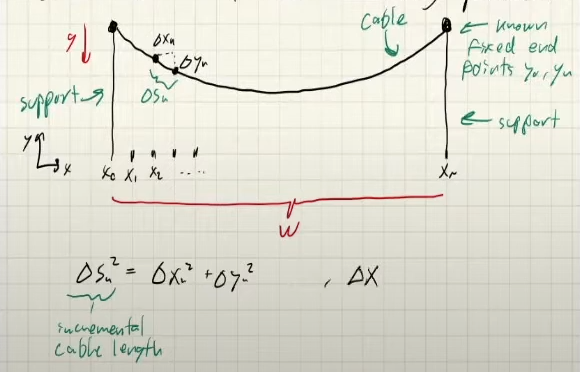

# Calculus of Variations

I will yoink most of the notes from Zack Manchester's Robot Dynamics 2022 class.

## Calculus

$$
\begin{align*}
\min_x f(x), \space f: \mathbb{R}^n \to \mathbb{R} \\
x \in \mathbb{R}^n
\end{align*}
$$

We often want to solve "infinite-dimensional" optimization problems, where the decision variable is a function. How do we get to this point?

Let $$y(t)$$ be such that $$y: [0,T] \to \mathbb{R}$$ and $$x \in \mathbb{R}^n$$, then $$x = \begin{bmatrix}y_1 && y_2 && ... && y_n \end{bmatrix}$$.

If we let $$n \to \infty$$, then we can get something "infinite-dimensional". Also we recover the continuous function $$y(t)$$.

**Example**:

$$f(x) = \frac{1}{N}\mathbf{x}^T \mathbf{x} = \sum_{n=1}^N \frac{1}{N} y_n^2$$

Functions of functions are called functionals.

This is a cost functional.
$$
\begin{equation*}
\min_x f(x) = \frac{1}{N} \mathbf{x}^T \mathbf{x} = F(y(t)) = \int_0^1 y(t)^2 \space dt
\end{equation*}
$$

Normally what we do is...

$$
\begin{align*}
\frac{\partial f}{\partial x} = \frac{2}{N}x^T = 0 \\
x^* = 0
\end{align*}
$$

We can look at this in components. We have to use the first-order approximation (linearization).

$$
\begin{align*}
\min_x \sum_{n=1}^N \frac{1}{N} y_n^2 \\
F(y(t) + \Delta y(t)) &\approx F(y) + \frac{\partial F}{\partial y}(\Delta y) \\
&= \int_0^1 y(t)^2 \space dt  + \int_0^1 2y(t) \Delta y(t) \space dt
\end{align*}
$$

At a minimum, the first-order term must be zero for all $$\Delta y(t)$$. This implies that $$y(t) = 0$$.

## Standard Notation for $$Delta$$

A variation of a functional $$\delta F$$ is ... the first-order term in the Taylor expansion of $$F(y + \delta y)$$ around $$y$$.

$$
\begin{align*}
\delta F = \int_0^1 2y(t) \delta y(t) \space dt
\end{align*}
$$

It is not common to write $$\frac{\delta F}{\delta y}$$ to denote the functional derivative.

## More interesting example (catenary)

- g: acceleration due to gravity
- $$\Delta s_n$$: incremental cable length.

Total cable length is $$\ell$$:
$$
\begin{align*}
\ell = \sum_{n=1}^{N-1} \Delta s_n = \sum_{n=1}^{N-1} \sqrt{\Delta x_n^2 + \Delta y_n^2} = \sum_{n=1}^{N-1} \sqrt{1 + \left(\frac{\Delta y_n}{\Delta x_n}\right)^2} \Delta x_n
\end{align*}
$$

Total mass:

$$
\begin{align*}
m = \sum_{n=1}^{N-1} \rho \Delta s_n \\
\rho = \frac{m}{\ell}
\end{align*}
$$

If we minimize the potential energy, we get the shape of the cable.

$$
\begin{align*}
V &= \sum_{n=1}^{N-1} \rho \Delta s_n g(\frac{y_{n+1} + y_n}{2}) \\
&= \sum_{n=1}^{N-1} \rho g \frac{y_{n+1} + y_n}{2} \Delta x \sqrt{1 + \left(\frac{\Delta y_n}{\Delta x_n}\right)^2}
\end{align*}
$$

Optimization will have a constraint:

$$
\begin{align*}
\min_{y_{1:N-1}} \sum_{n=1}^{N-1} \rho g \frac{y_{n+1} + y_n}{2} \Delta x \sqrt{1 + \left(\frac{\Delta y_n}{\Delta x_n}\right)^2} \\
\text{s.t. } \sum_{n=1}^{N-1} \Delta s_n = \ell
\end{align*}
$$

NOTE that $$y_0, y_N$$ are fixed (boundary conditions).

Generic version:

$$
\begin{align*}
\min_x \sum_{n=1}^{N-1} f(y_n, y_{n+1}) \\
\text{s.t. } \sum_{n=1}^{N-1} c(y_n) = 0 \\
L(x,\lambda) = \sum_{n=1}^{N-1} f(y_1, ..., y_{n-1}) + \lambda c(y_n)
\end{align*}
$$

Last equation is the Lagrangian.

KKT Conditions:

$$
\begin{align*}
\frac{\partial L}{\partial \delta x} &= \sum_{n=1}^{N-1} D_1 f(y_n, y_{n+1}) \Delta y_n 
\\ &+ D_2 f(y_n, y_{n+1}) \Delta y_{n+1} \\ &+ \lambda D c(y_n) \Delta y_n \\
&= 0 \space \forall \Delta x \\

\frac{\partial L}{\partial \lambda} &= c(x) \\ &= 0
\end{align*}
$$

If we assume endpoints are fixed then we will get for our first-order necessary condition:

$$
\begin{align*}
\frac{\partial L}{\partial \delta x} &= \sum_{n=1}^{N-1} D_2 f(y_{n-1}, y_n) \Delta y_n + D_1 f(y_n, y_{n+1}) \Delta y_n + \lambda D c(y_n) \Delta y_n \\
&= (D_2 f(y_{n-1}, y_n) + D_1 f(y_n, y_{n+1}) + \lambda D c(y_n)) \Delta y_n
&= 0
\end{align*}
$$

The punch line is...

$$
\begin{align*}
D_2 f(y_{n-1}, y_n) + D_1 f(y_n, y_{n+1}) + \lambda D c(y_n) = 0
\end{align*}
$$

Now we can look at the limit $$N \to \infty$$. We get...

$$
\begin{align*}
\min_{y(t)} \int_0^T f(y(t), \dot y(t)) \space dt \\
\text{s.t. } \int_0^T s(y(t)) \space dt = \ell \\
L(y(t), \lambda) = \int_0^T f(y(t), \dot y(t)) + \lambda s(y(t)) \space dt
\end{align*}
$$

KKT Conditions in Variational Calculus:

$$
\begin{align*}
\frac{\partial L}{\partial y(t)}[\Delta y(t)] &= \int_0^T D_1 f(y(t), \dot y(t)) \Delta y(t) \\
&+ D_2 f(y(t), \dot y(t)) \Delta \dot y(t) \\
&+ \lambda D s(y(t)) \Delta y(t) \space dt \\
&= 0 \space \forall \Delta y(t)
\end{align*}
$$

$$
\begin{align*}
\frac{\partial L}{\partial \lambda}[\Delta y] = \int_0^T c(y(t)) \space dt = 0
\end{align*}
$$

Similar to discrete case, we want to factor out $$\Delta y(t)$$ to derive local optimality conditions.

The key move is integration by parts which is the common trick for variational calculus.

$$
\begin{align*}
\frac{d}{dt}(u(t) \star v(t)) &= \dot u(t) \star v(t) + u(t) \star \dot v(t) \\
u(t) \star v(t) \Big|_0^T &= \int_0^T \dot u(t) \star v(t) \space dt + \int_0^T u(t) \star \dot v(t) \space dt \\
\int_0^T u(t) \star \dot v(t) \space dt &= u(t) \star v(t) \Big|_0^T - \int_0^T \dot u(t) \star v(t) \space dt
\end{align*}
$$