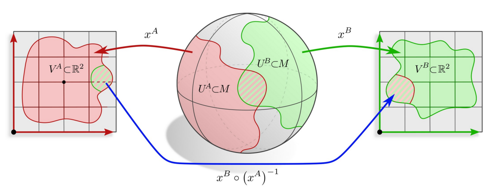

# GDL 3: Manifolds

## Topological Manifolds
<b> Definition 1.1 </b> (Topological Manifold) <i> A topological space $$M$$ is called a d-dimensional (topological) manifold if around every point $$p \in M$$ there exists a neighborhood $$U \subset M$$ and a homeomorphism </i>

$$
x: U \to x(U) := V \subseteq \mathbb{R}^d
$$

The tuple $$(U,x)$$ is called a chart of $$M$$ and the components of $x_i$$ are called coordinates. 

Atlas of a manifold $$M$$ is a set of charts $$\mathcal{A} = \{(U^l, x^l)\}_{l \in L}$$ such that $$\bigcup_{l \in L} U^l = M$$.

The homeomorphisms $$x^B \circ (x^A)^{-1}$$ are called transition maps.

---

## Smooth Manifolds

We want to differentiate functions $$f: M \to \mathbb{R}$$ on the manifold.

Define differentiation on $$M$$ by pulling back functions via chart $$x^A$$ to $$\mathbb{R}^d$$.

$$
\begin{equation}
f \circ (x^A)^{-1}: V^A \to \mathbb{R}
\end{equation}
$$

ensure consistency among charts (that is charts need to be smoothly compatible) i.e. $$x^B \circ (x^A)^{-1}$$ is smooth.

We obtain a smooth manifold by adding an atlas with smooth transition maps.

<b> Definition 1.2 </b> (Smooth Atlas) <i> An atlas $$\mathcal{A}$$ is called smooth (differentiable) if the transition maps between any two overlapping charts are smooth (differentiable). </i>

<b> Definition 1.3 </b> (Smooth Manifold) <i> A smooth manifold is a topological manifold equipped with a smooth atlas. </i>

<b> Definition 1.4 </b> (Smooth map) <i> Let $$\phi: M \to N $$ be a map between smooth map at $$p \in M$$ if for some smooth charts $$(U_M, x_M)$$ and $$(U_N,x_N)$$ around $$p$$ and $$\phi(p)$$, the map $$x_N \circ \phi \circ x_M^{-1}$$ is smooth in the usual sense on $$\mathbb{R}^d$$ </i>

<b> Definition 1.5 </b> (Smooth curve) <i> A smooth curve on $$M$$ is a smooth map $$\gamma: \mathbb{R} \to M$$. </i>

<b> Definition 1.6 </b> (Tangent space (informal)) <i> The tangent space $$T_pM$$ at $$p \in M$$ is the vector space spanned by the tangent vectors $$\gamma'(0)$$ of smooth curves $$\gamma: \mathbb{R} \to M$$ with $$\gamma(0) = p$$. </i>

$$
\begin{equation}
T_pM := \{ \gamma'(0) \mid \gamma: \mathbb{R} \to M, \quad \gamma(0) = p, \quad \gamma \in \mathcal{C}^d, d \geq 1 \}
\end{equation}
$$

Disjoint union of tangent spaces forms the tangent bundle $$TM$$ of $$M$$.

Despite tangent spaces being vector spaces, they do not have a canonical reference frame (basis), so we need to pick some frame to represent tangent vectors numerically - different choices possible!

The set of all reference frames form the <b> frame bundle </b> $$FM$$ of $$M$$.

A chart induces a <b> frame field </b>

<b> Definition 1.7 </b> (Diffeomorphism) <i> Let $$\phi: M \to N$$ be a bijective map between smooth manifolds. if both $$\phi$$ and $$\phi^{-1}$$ are smooth, then $$\phi$$ is said to be a diffeomorphism. $$M \cong N$$ if they are diffeomorphic. </i>

$$
\text{Diff}(M) := \{ \phi: M \to M \mid \phi \text{ is diffeomorphic} \}
$$

$$\text{Diff}(M)$$ are the symmetries of a smooth manifold M - if we want isometries, we need to add a metric structure.

---

## Riemmanian Manifolds

<b> Riemmanian metric tensor fields </b> endow smooth manifolds with notion of distance. The metric tensor field $$\eta$$ is a smooth assignment of positive definite inner products

$$
\begin{equation}
\eta_p: T_pM \times T_pM \to \mathbb{R} \text{  s.t.  } \eta_p(v,v) \geq 0
\end{equation}
$$

<b> norms of tangent vectors </b> are defined as usual: $$ \|v\| := \sqrt{\eta_p(v,v)} \space \forall v \in T_pM$$

<b> lengths </b> of smooth curves $$\gamma: [a,b] \to M $$ are defined by integrating their tangent vectors ("velocities") along $$\gamma$$:

$$
\begin{equation}
l_\gamma = \int_a^b \| \frac{d}{dt} \gamma(t) \| dt
\end{equation}
$$

the <b> distance </b> $$d_\eta(p,q)$$ between two points $$p$$ and $$q$$ is the length of the shortest curve between them (geodesic):

$$
\begin{align*}
d_\eta: M \times M \to \mathbb{R}_{\geq 0} \\
d_\eta(p,q) := \inf \{ l_\gamma \mid \gamma \text{ is a piecewise smooth curve from p to q} \}
\end{align*}
$$

<b> isometries </b> are <b> distance preserving maps </b> between Riemmanian manifolds:

<b> Definition 1.8 </b> (Isometry) <i> An isometry $$\phi: M \to N$$ for between Riemmanian manifolds $$(M,\eta_M)$$ and $$(N,\eta_N)$$ is a diffeomorphism such that $$\eta_N(\phi_*v, \phi_*w) = \eta_M(v,w)$$ $$\forall v,w \in T_pM$$ , where $$\phi_*$$ is the pushforward of the metric tensor field. </i>

the symmetries of a Riemmanian manifold form its <b> isometry group </b>

$$
\text{Isom}(M) := \{ \phi: M \to N \mid \phi \text{ is an isometry} \}
$$

all metric derived properties (geodesics, curvature, Levi-Civita connection, ...) are preserved by isometries.

The metric induces a (unique) Levi-Civita connection = "infinitisimal transport"

finite parallel transporters along paths $$\gamma$$ follow by integration.

parallel transport is in general path dependent

transport between mesh faces "unfold, shift, fold back" - this is the "holonomy" of the connection.

the <b> intrinsic (Riemann) curvature tensor </b> measures the amount of rotation of a vector when transporting it in infiniesimal circle.

contracted ("index-averaged") versions: Ricci/scalar/Gaussian curvature

for <b> embedded manifolds </b>, we also have several measures for extrinsic

curvature at a vertex of a 2d-mesh, corresponds to its angle defect

the <b> Riemmanian exponential maps </b> $$\exp_p: T_pM \to M$$ send vectors $$v \in T_pM$$ to points $$\exp_p(v) \in M$$ by walking a distance $$\|v\|$$ along the geodesic in direction of $$v$$.

useful for Riemannian gradient descent

in general only locally injective
the inverse is locally given by the <b> Riemmanian logarithmic map </b>:

$$
\begin{equation}
\log_p = \exp^{-1}_p: M \supseteq U_{p,\text{injective}} \to T_pM
\end{equation}
$$

---

## Fiber Bundles

Globally trivial bundles are spaces that can be written as a product:

$$
E = M \times F
$$

M is manifold (base space) and F is the fiber.

globally trivial bundles are in particular locally trivial over a neighborhood $$U \subseteq M $$

general fiber bundles are locally trivializable, but not necessarily global products.

<b> Fiber bundles </b> $$(E, M, \pi, F)$$ are structures consisting of...

- E (total space)
- M (base space)
- F (fiber)
- a continuous surjective bundle projection map $$\pi: E \to M$$

such that aroundd every $$p \in M$$ there exists a trivializing neighborhood $$U \subseteq M$$ and a homeomorphism (local trivialization) $$\psi: \pi^{-1}(U) \to U \times F$$ satisfying $$\text{proj}_1 \circ \psi = \pi$$

the global topological structure is recovered from an atlas of local trivializations. $$\mathcal{A} = \{ (U^I, \psi^I) \}_{I \in \mathcal{J}} $$

by gluing the trivializations together with transition maps

$$
\begin{equation}
\text{id} \times g^{BA} := \psi^{B} \circ (\psi^A)^{-1} : (U^A \cap U^B) \times F \to (U^A \cap U^B) \times F
\end{equation}
$$

The tangent spaces of a smooth manifold form the tangent bundle $$(TM, M, \pi_{TM}, \mathbb{R}^d)$$

with total space $$TM := \bigcup_{p \in M} T_pM$$ and projection map $$\pi_{TM}: TM \to M$$ given by $$\pi_{TM}(v) = p$$ for $$v \in T_pM$$.

local trivializations $$\psi^A$$ identify tangent spaces over $$U^A$$ with $$\mathbb{R}^d$$ $$\implies$$ inducing reference frames on $$T_pM$$ transition maps $$\psi^B \circ (\psi^A)^{-1}$$ glue the fibers $$\mathbb{R}^d$$ together over $$U^A \cap U^B$$ via structure group elements.

<b> additional structure </b> on M allows to restrict to a G-atlas of trivializations with a reduced structure group G.

the frame bundle $$(FM, M, \pi_{FM}, GL(d))$$ is the bundle consisting of all reference frames of all tangent spaces

its fiber is the general linear group i.e. $$F_pM \cong_{\text{top}} GL(d)$$

G-structures correspond to sub-bundles of frames with fiber $$G \leq GL(d)$$

they are in 1-to-1 relation with G-atlases of TM.

