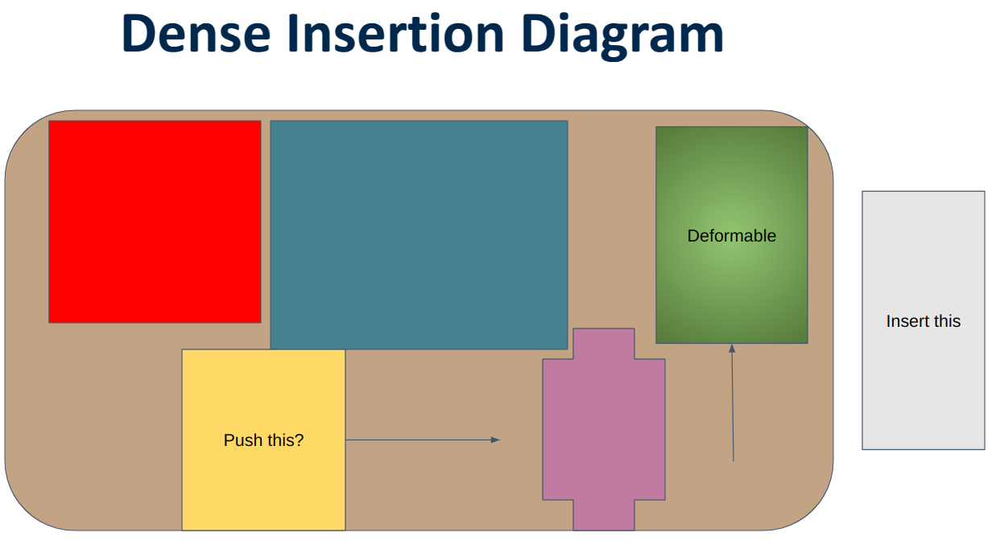

# Project 1: Graph Insertion

Everything I do in this project must satisfy Amazon's requirements for dense insertion.

## Dense Insertion

<b> Dense Insertion </b> is a task where a robot arm must autonomously insert a set of objects into a bin. As more objects are inserted into a bin, it gets harder to insert more objects.

I don't know what the proposal was for this project, but I think it involves using <b> extrinsic contact </b> to figure out how to best insert an object. 

## Dynamics+MPC vs. RL vs. IL

As of the time of writing, we are heading towards using RL. I just want to make sure that this is the correct choice.

<b> Dynamics+MPC </b> is a method we can try that involves learning the dynamics of the system and utilizing sampling-based MPC to solve the task by designing a cost function. 

This method was used in Robopack which seemed like it took forever to do dense insertion. This is most likely due to running the MPC for a long time then running the plan in open-loop and hoping it all works. We may run into the same issues if we try to do this.

<b> IL </b> is a method we can try which involves curating demonstrations of us doing dense insertion and having a robot imitate us. This is the most popular method for other manipulation tasks, but it is not clear if it will work for dense insertion. IL has issues with generalization where even small changes in the environment can cause the robot to fail. Combine this with different object configurations inside one bin and it is not clear if this will work.

<b> RL </b> by process of elimination, I guess RL should work. It doesn't have the limitations of IL and Dynamics+MPC, but it is super hard to train and make work.

---

## More Dense Insertion

<b> Simplification </b>
While the dense insertion task is actually all about inserting multiple objects into a bin and planning to figure out how to place them such that there is enough space for the next object, we can simplify this to just inserting one object into a bin.

Lets consider a diagram of the dense insertion problem. We want to insert an object into a bin. It's relatively large, so there is no direct space to insert the object. We have to make our own space by pushing other objects out of the way. There are two things to consider:
1. We can push objects out of the way if we know that there is space to push them into.
2. We can push deformable out of the way and hope that they will move out of the way.

Both of these will create space for us to insert the object.

<b> Question: Can we zero-shot figure out the compliance of the scene? </b> 
- I don't think you can figure this out by just looking at the scene. You need to poke around to see if you can insert the object.
- Another way is to have this information as a prior. When we insert the objects one-by-one, we should be able to figure out which parts are stiff and which parts are compliant.

---

## Extrinsic Contact

If we did an end-to-end approach whether it is MPC+Dynamics, RL, or IL, there are too many configurations that are possible. Just think of the combinatorial enumeration of the object order in the bin. Making an e2e policy that can handle an arbitrary configuration is hard. Instead, we have to break the problem down into pieces. 

Just like how vision uses convolutions to exploit the symmetry in the data, how can we exploit the "symmetry" in dense insertion?

<b> Simplification 2 </b>, assume we know all of the object geometries and inertial properties.

Even with these simplifications, the enumeration problem remains, but we have removed some of the complexity.

Lets say we are holding a rigid object and trying to insert it into a bin by pushing away another object (rigid/compliant). 

---

<b> Idea 1: </b> We could make a tactile controller to ensure intrinsic object pose is stabilized while pushing our object into the bin. 
- we can represent the interaction between the end-effector, intrinsic object, and extrinsic object as a graph.
- <b> subidea 1.1: </b> we can learn the graph dynamics and use that to stabilize.
- <b> subidea 1.2: </b> we can just learn a general controller that can stabilize based on IL/RL.

This idea might be too explicit and not general enough. Do we even need a tactile controller?

---

<b> Idea 2: GNN as observation head </b> We construct a graph $$\mathcal{G} = (\mathcal{V}, \mathcal{E})$$ from scene keypoints including objects, bin, and end-effector, and connect it up using knn-graph scheme. We plan to include extrinsic contact by adding it into the vertex features. We learn the contact forces for each vertex $$v \in \mathcal{V}$$ and whether it's in contact.

$$
\begin{equation*}
v = \begin{bmatrix}
x \\
y \\
z \\
c \\
\mathbf{f}_{c}
\end{bmatrix}
\end{equation*}
$$

where $$c \in \{0, 1\}$$ is a binary variable indicating whether the vertex is in contact or not with the end-effector and $$\mathbf{f}_{c}$$ is the contact force.

We then do some message-passing and then max-pool the graph to get a single embedding. We then pass this along for policy learning.

<b> Pooling Problem </b> We want to utilize extrinsic contact as seen in miquel's work. However, that work uses the object geometry and forces forces acting on the geometry to calculate the force controller output. Max-pooling takes away the geometrical structure of the graph by compressing it into a single embedding. My real question is whether a single embedding is enough to represent the extrinsic contact structure from miquel's work (roughly).
- <b> Suggestion </b>: Maybe we keep the graph structure and just output forces on each node, and have our robot move such to satisfy force-balance.

<b> Contact Var Problem </b> I have some issues with this design choice:
- Using the closeness of the objects, could the knn-graph scene not be enough to represent contact? The connectivity between two nodes show that the features of one node (contact forces) will affect the other node. We can think of it as the vertex shooting a message to its neighbors.
- If we don't have the full object graph, the other unseen vertices might be in contact and affect the forces. A human doing dense packing can do shape completion and understand (relatively) which objects are in contact and thus act accordingly. I feel like contact is a sensitive problem (numerically) where one small change can lead to a large change in system behavior. I think we need to be careful about this.

<b> Main issue with Obs Head GNN </b> We're kind of just hoping that with forces and GNN, it'll work itself out. I feel like it's hard to convince ourselves that this is the right way to go. 

---

<b> Key Question: How does explicit modelling extrinsic contact help? </b> In the most abstract-level, extrinsic contact is all about object interaction through forces. Dense Insertion is all about object interaction through forces. In that sense, how should we model object interaction through forces?

<b> Idea 3: Multi-object interaction </b> We can give each object in the scene a full object graph. 

