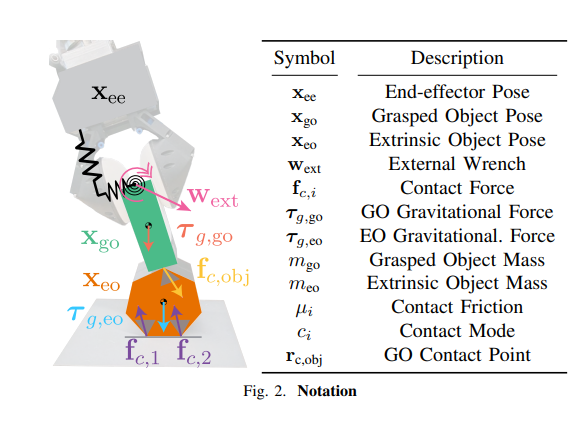

# Tactile-driven Non-prehensile Control via Extrinsic Contact Mode Control

[Link](https://coronadoenrique.com//rssproceedings2024/rss20/p135.pdf)

This is a more explicit paper that uses extrinsic contact for control. We grasp on object using a bubble gripper and use it to pivot/push another object.

It's a fairly straightforward setup and the controller is solve using a Quadratic Program (QP). It assumes quasi-static for simplicity.

Measurements:
- $$\mathbf{w}_{\text{ext}}$$ - this is the Force-Torque (FT) sensor measurement if we subtract the weight of the end-effector below the FT sensor. 
- $$\mathbf{x}_{\text{ee}}$$ - this comes from proprioception (joints of Kuka Iiwa).
- $$\mathbf{x}_{\text{go}}$$ - we can get this from apriltag.
- $$\mathbf{x}_{\text{eo}}$$ - we can get this from apriltag.

Givens:
- $$m_{\text{go}}$$ - we measure
- $$m_{\text{eo}}$$ - we measure
- $$\mu_i$$ - we calibrate to get

We recover contact points (object frame) using Contact Particle Filter. This also gives us the contact jacobian. This allows us to map the contact forces from end-effector to object and object to ground to world frame.

Using this, we can solve for the contact forces on the extrinsic contact points to perform our tasks. Then, SEED (another force-controller using springs-dampers) is used to enforce those contacts forces.

We model the optimization problem for contact forces as follows:

$$
\begin{align*}
\min_{\mathbf{f}_{c,1},..,\mathbf{f}_{c,N}} &\sum_{i=1}^N \frac{1}{2} \mathbf{f}_{c,i}^T \mathbf{U} \mathbf{f}_{c,i} \\
s.t. \quad &\mathbf{\tau}_{g,eo} + \sum_{i=1}^N \mathbf{J}_{c,i}^T \mathbf{f}_{c,i} = 0, \\
&\mathbf{w}_{ext} + \mathbf{\tau}_{g,go} + \sum_{j \in \text{obj}} \mathbf{J}^T_{c,go,j}\mathbf{f}_{c,j} = 0 \\
&0 \leq \mu_i f_{c,i,n} + f_{c,i,t} \perp \dot s_{c,i}^+ \geq 0 \quad i = 1,...,N \\
&0 \leq \mu_i f_{c,i,n} - f_{c,i,t} \perp \dot s_{c,i}^- \geq 0 \quad i = 1,...,N
\end{align*}
$$

We can further simplify this problem by only considering the grasped object and the extrinsic object.

$$
\begin{align*}
\min_{\mathbf{f}_{c,1},..,\mathbf{f}_{c,N}} &\sum_{i=1}^N \frac{1}{2} \mathbf{f}_{c,i}^T \mathbf{U} \mathbf{f}_{c,i} \\
s.t. \quad &\mathbf{w}_{ext} + \mathbf{\tau}_{g,go} + \sum_{j \in \text{obj}} \mathbf{J}^T_{c,go,j}\mathbf{f}_{c,j} = 0 \\
&0 \leq \mu_i f_{c,i,n} + f_{c,i,t} \perp \dot s_{c,i}^+ \geq 0 \quad i = 1,...,N \\
&0 \leq \mu_i f_{c,i,n} - f_{c,i,t} \perp \dot s_{c,i}^- \geq 0 \quad i = 1,...,N
\end{align*}
$$

For contact-mode control, we already set the complementarity constraints, so they just become linear inequality constraints. Thus, this becomes a QP. 
- For pushing, we want the extrinsic object to ground contact to be sliding.
- For pivoting, we want the extrinsic object to ground contact to be sticking (and only one is in contact).

In order for seed to enforce these contacts, we actually model a nonlinear optimization problem. SEED allows us to convert end-effector poses and grasped object poses to an external wrench. The QP allows us to convert the external wrench to contact forces. We use all of this to stabilize the relative end-effector to object trajectory and contact modes.

## Questions:
- It seems like we can easily extend this problem to multiple objects. Can we?
- This is a very strict regime. As in, we have to set the friction parameters, contact locations, and find object pose. Can we soften this regime to be much more friendly?

## Extension to multi-object (not in paper)

So the current implementation goes like this:
- end-effector grasps object
- object interacts with extrinsic object
- extrinsic object interacts with ground

1. Given target poses, get external wrench from end-effector to grasped object.
2. Use external wrench to get contact forces from extrinsic object to ground.

To extend to multiple objects, it's fairly simple
1. Given target poses, get external wrench 1 from end-effector to object 1.
2. Use external wrench 1 (should be sticking) contact forces from object 2 to object 3. These contact forces will be external wrenches if object 2 is in contact with object 3.
3. Use external wrenches from object 2 to object 3 to get contact forces from object 3 and object 4. ... And so on and so forth

This is a simple extension and the problem is still a QP. It's fairly tough to solve though (could be infeasible) and could be very sensitive as the number of objects increase. 

