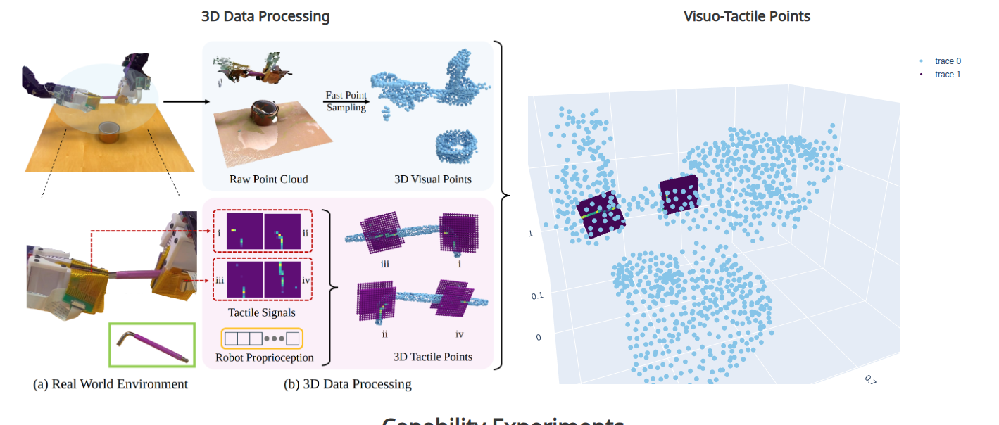
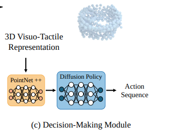
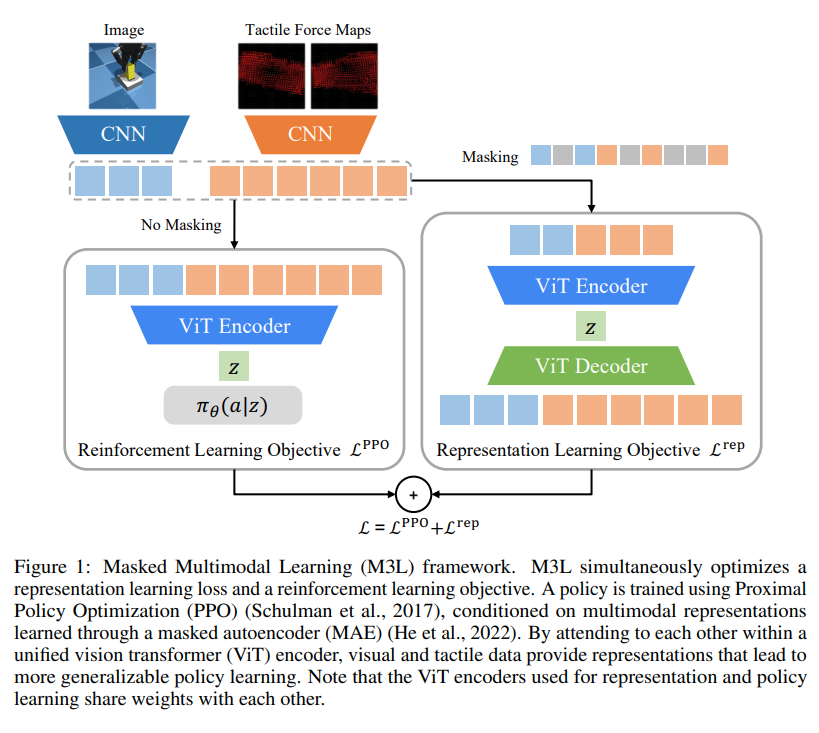

# Point RL

We're currently trying to use PointNet to learn a policy for dense insertion. The idea is to use PointNet to combine features from point clouds and tactile data.

The interest stems from the fact that everything we do lies in the 3d world. However, we currently limit ourselves to data that lies in 2d space. Currently, most people use RGB-based policies or visuo-tactile policies which also uses 2d images. 

There are already works that do 3d point cloud-based policies. However, they don't utilize the force information that you get through tactile sensors. 

## Related works

### 3D-ViTac

[3D-ViTac](https://arxiv.org/pdf/2410.24091) uses tactile sensors to get point clouds. 
- It uses PointNet++ as the backbone.
- It includes visual point clouds and tactile point clouds.
- It uses one-hot encoding to differentiate between the two types of point clouds.
- This is object-centric.

### 3D Diffusion Policy

[3D-DP](https://arxiv.org/abs/2403.03954) uses scene point clouds with diffusion policy.

- It uses PointNet for a baseline.
- It takes a scene point cloud.
- Removes things like input transform and feature transform from PointNet implementation.

### M3L Paper

[M3L](https://arxiv.org/pdf/2311.00924)
- RL training with 2d data with image + tactile image.
- Masked Multi-modal learning

### 3D-RL

[3D-RL](https://arxiv.org/pdf/2306.06799) some general paper on trying pointcloud-based RL.
- Tries PointNet and 3D SparseConvNet.
- Suggests processing temporal data with MinkowskiNet (not computationally efficient).
- These guys use one-hot encoding to differentiate between frames for object.

### Dense Robotic Packing

[Dense Robotic Packing](https://ieeexplore.ieee.org/stamp/stamp.jsp?tp=&arnumber=9505314&tag=1) This paper is about dense insertion of objects in a bin. It uses geometrical intuition to figure out where to insert.

- TODO: finish reading in full.

### ManipGen

[ManipGen](https://mihdalal.github.io/manipgen/resources/paper.pdf) is a paper that tries to address scene generation in addition to manipulation.

### Steerable Scene Generation

[Steerable Scene Generation](https://arxiv.org/pdf/2505.04831)
- TODO: read

### Asymmetric Actor Critic
[Asymmetric Actor Critic](https://arxiv.org/pdf/1710.06542)
- TODO: read

### Badminton Asymmetric Actor Critic
[Badminton Asymmetric Actor Critic](https://www.science.org/doi/10.1126/scirobotics.adu3922)

- this is more of a systems paper.
- use as a reference for engineering.
- it's in science because of how good the system is.
- TODO: read

### Unicorn-Hamnet

[Unicorn-Hamnet](https://unicorn-hamnet.github.io/static/pdf/paper.pdf)
- automatic generation of robot manipulation scene.
- TODO: read

### CORN

[CORN](https://arxiv.org/pdf/2403.10760)
- TODO: read

### Point-BERT
[Point-BERT](https://arxiv.org/pdf/2111.14819)

### Point-M2AE
[Point-M2AE](https://arxiv.org/abs/2205.14401)

### Point-MAE
[Point-MAE](https://arxiv.org/abs/2203.06604)

### Point Transformer
[Point Transformer](https://ieeexplore.ieee.org/document/9710703)

### 